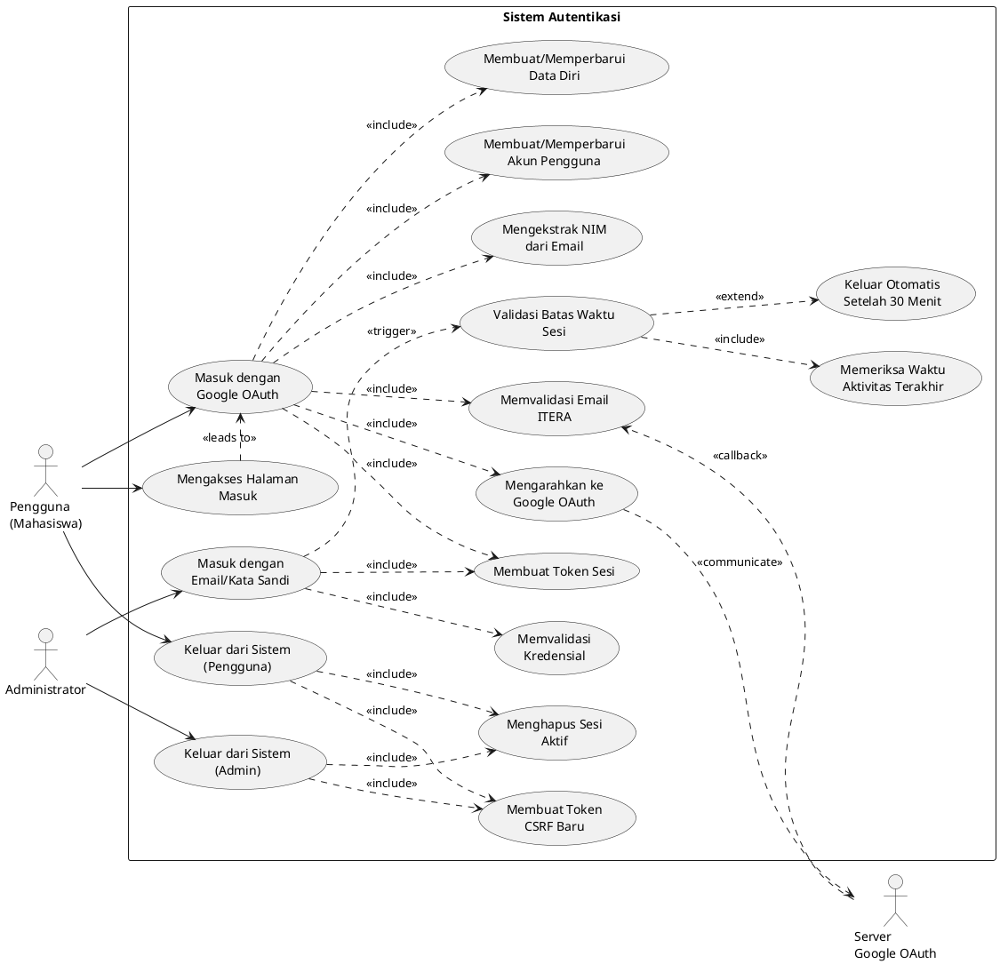
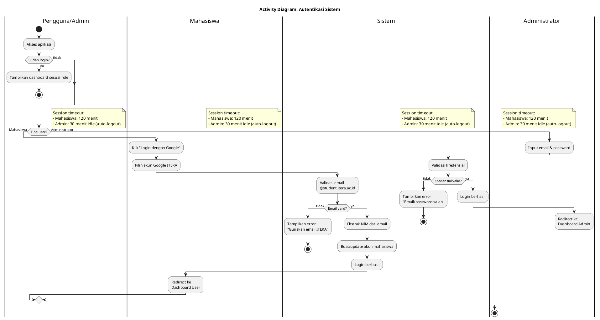
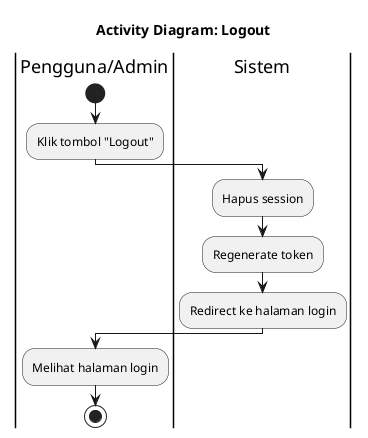
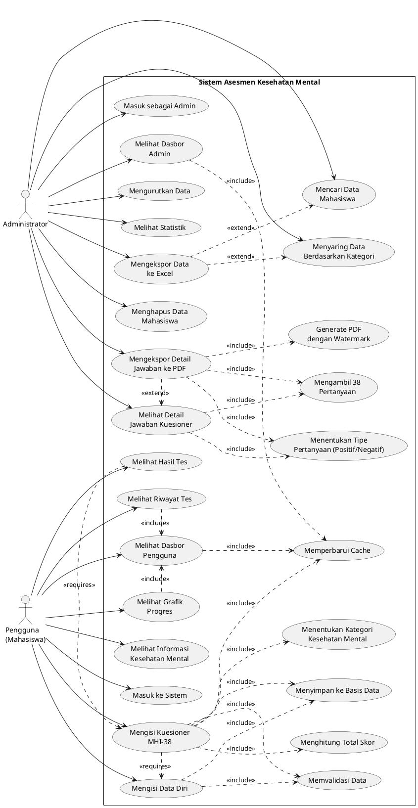
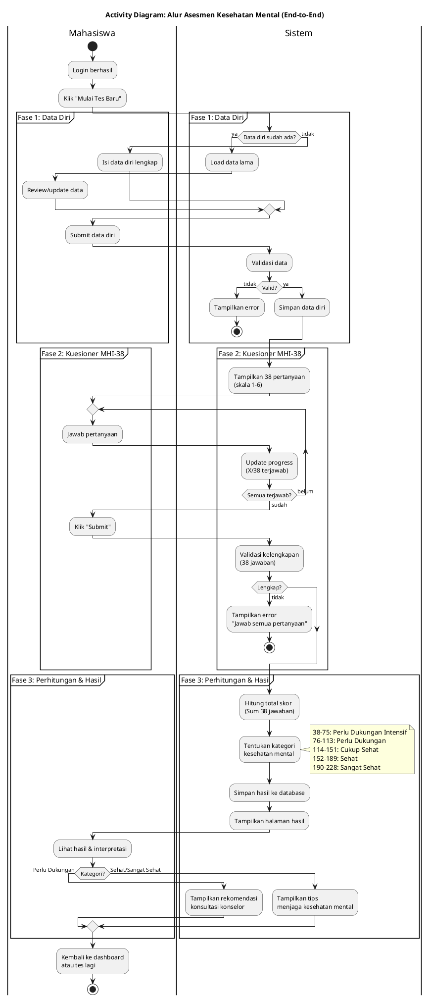
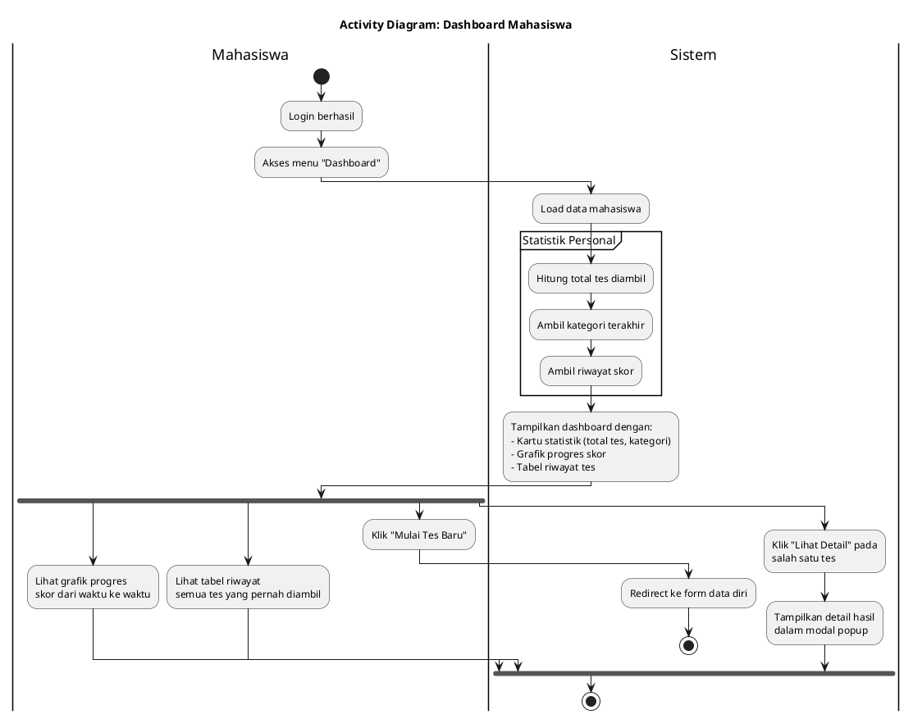
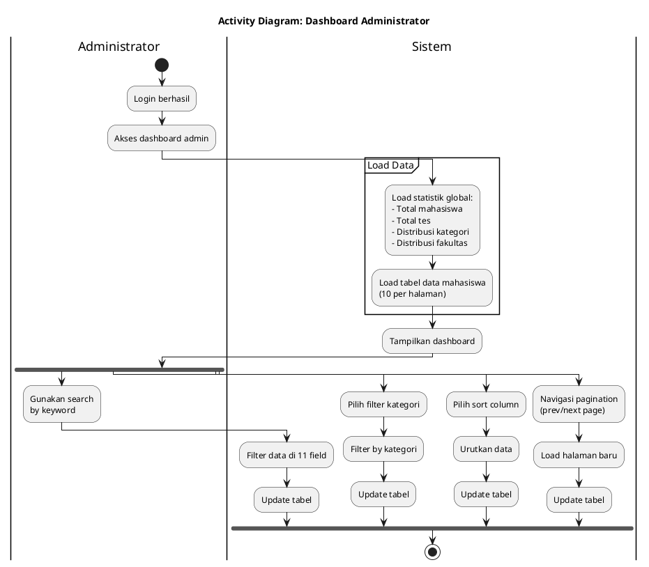
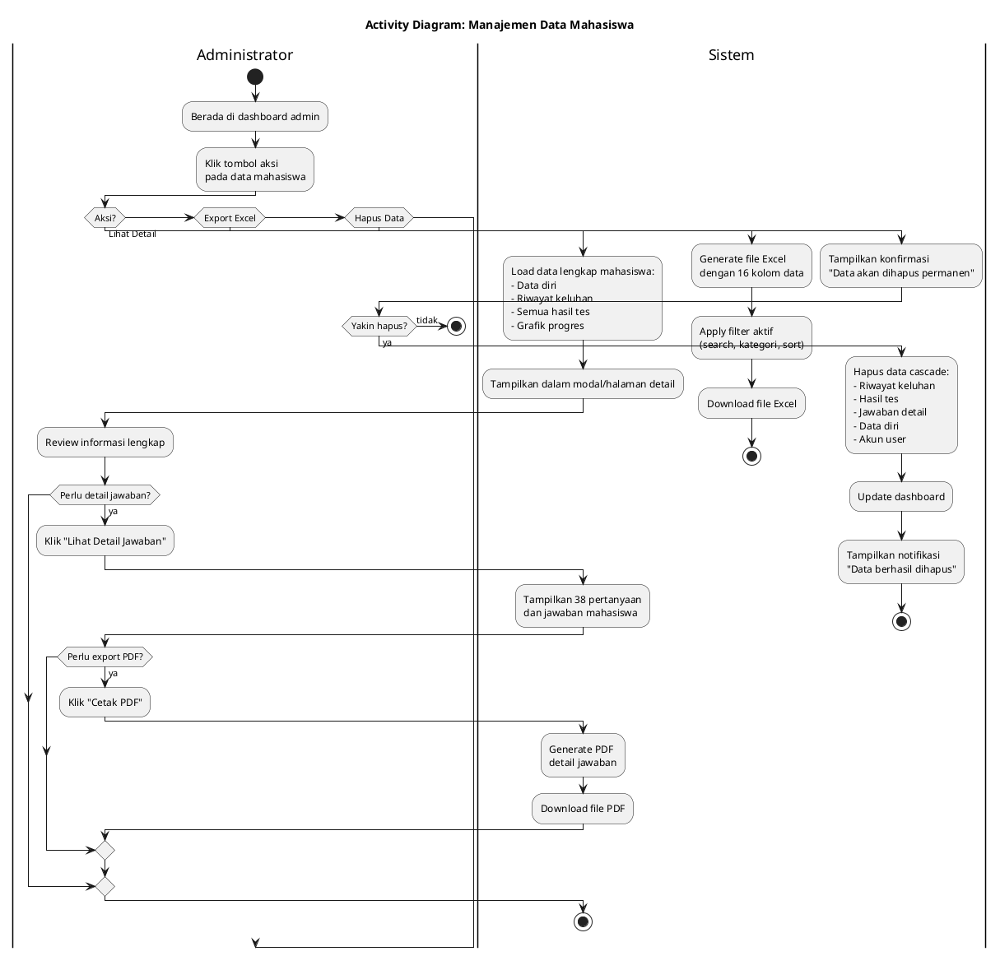

# Use Case dan Activity Diagram - Mental Health Assessment System

**Versi:** 2.0 (Simplified untuk Skripsi)
**Tanggal Update:** 24 November 2025
**Catatan:** Activity Diagram telah disederhanakan untuk fokus pada alur bisnis utama

## Daftar Isi

### Bagian 1: Autentikasi

1. [Use Case Diagram - Autentikasi](#use-case-diagram-autentikasi)
2. [Activity Diagram - Autentikasi Sistem (SIMPLIFIED)](#activity-diagram-autentikasi-sistem)

### Bagian 2: Fitur Kesehatan Mental - Pengguna

3. [Use Case Diagram - Mental Health](#use-case-diagram-mental-health)
4. [Activity Diagram - Alur Asesmen Kesehatan Mental (SIMPLIFIED)](#activity-diagram-alur-asesmen-kesehatan-mental)
5. [Activity Diagram - Dashboard Mahasiswa (SIMPLIFIED)](#activity-diagram-dashboard-mahasiswa)

### Bagian 3: Fitur Kesehatan Mental - Admin

6. [Activity Diagram - Dashboard Administrator (SIMPLIFIED)](#activity-diagram-dashboard-administrator)
7. [Activity Diagram - Manajemen Data Mahasiswa (SIMPLIFIED)](#activity-diagram-manajemen-data-mahasiswa)

---

# BAGIAN 1: AUTENTIKASI

---

## Use Case Diagram Autentikasi



---

## Activity Diagram: Autentikasi Sistem

**Catatan:** Diagram ini menggabungkan Login Mahasiswa (Google OAuth), Login Admin (Email/Password), dan Logout dalam satu diagram yang disederhanakan.



### Logout (untuk Mahasiswa & Admin)



---

# BAGIAN 2: FITUR KESEHATAN MENTAL - PENGGUNA

---

## Use Case Diagram Mental Health



---

## Activity Diagram: Alur Asesmen Kesehatan Mental

**Catatan:** Diagram ini menggabungkan seluruh alur end-to-end: Data Diri → Kuesioner → Hasil



---

## Activity Diagram: Dashboard Mahasiswa

**Catatan:** Diagram ini menunjukkan fitur Dashboard User untuk melihat statistik dan riwayat



---

# BAGIAN 3: FITUR KESEHATAN MENTAL - ADMIN

---

## Activity Diagram: Dashboard Administrator

**Catatan:** Diagram ini menggabungkan fitur Dashboard, Search, Filter, Sort, dan Pagination



---

## Activity Diagram: Manajemen Data Mahasiswa

**Catatan:** Diagram ini menggabungkan fitur View Detail, Export Excel, Export PDF, dan Delete Data



---

## Penjelasan Tambahan

### Kategori Kesehatan Mental (berdasarkan Total Skor MHI-38)

| Total Skor | Kategori                | Interpretasi                                     |
| ---------- | ----------------------- | ------------------------------------------------ |
| 190-226    | Sangat Sehat            | Kondisi mental sangat baik, terus pertahankan    |
| 152-189    | Sehat                   | Kondisi mental baik, jaga pola hidup sehat       |
| 114-151    | Cukup Sehat             | Kondisi mental cukup baik, perlu perhatian lebih |
| 76-113     | Perlu Dukungan          | Disarankan untuk konsultasi dengan konselor      |
| 38-75      | Perlu Dukungan Intensif | Sangat disarankan segera konsultasi profesional  |

### Skala Likert MHI-38

Setiap pertanyaan menggunakan skala 1-6:

-   1 = Tidak pernah
-   2 = Jarang
-   3 = Kadang-kadang
-   4 = Sering
-   5 = Sangat sering
-   6 = Selalu

Total skor dihitung dengan menjumlahkan semua jawaban (38 pertanyaan × max 6 poin = 228 poin maksimal, namun kategori tertinggi sampai 226).

### Fitur Cache

-   **User Dashboard**: Cache 5 menit per user (key: `user_dashboard_{nim}`)
-   **Admin Stats**: Cache 1 menit (key: `admin_mental_health_stats`)
-   Cache di-invalidate saat:
    -   User submit kuesioner baru
    -   Admin hapus data mahasiswa

### Fitur Keamanan

-   Middleware `auth` untuk semua route user
-   Middleware `AdminAuth` untuk semua route admin
-   Form validation menggunakan FormRequest
-   CSRF protection pada semua form POST/DELETE
-   Soft delete consideration (saat ini hard delete)

---

## Penjelasan Autentikasi

### Dual Authentication System

Sistem ini menggunakan **dua guard autentikasi terpisah**:

1. **Guard 'web'** - Untuk User/Mahasiswa

    - Menggunakan Google OAuth Single Sign-On
    - Primary key: NIM (9 digit dari email)
    - Email format: `{NIM}@student.itera.ac.id`
    - Session lifetime: 120 menit
    - Tidak ada session timeout otomatis

2. **Guard 'admin'** - Untuk Admin
    - Menggunakan email/password tradisional
    - Session lifetime: 120 menit
    - Session timeout: 30 menit inactivity (via middleware)
    - Password di-hash dengan bcrypt

### Google OAuth Flow (User)

**URL Endpoints:**

-   Redirect: `GET /auth/google/redirect`
-   Callback: `GET /auth/google/callback`

**Environment Variables Required:**

```env
GOOGLE_CLIENT_ID=your_client_id
GOOGLE_CLIENT_SECRET=your_client_secret
GOOGLE_REDIRECT_URI=http://your-app.com/auth/google/callback
```

**Email Validation Regex:**

```regex
/(\d{9})@student\.itera\.ac\.id/
```

**Contoh Email Valid:**

-   `123456789@student.itera.ac.id` → NIM: 123456789 ✅
-   `121450123@student.itera.ac.id` → NIM: 121450123 ✅

**Contoh Email Tidak Valid:**

-   `john@gmail.com` ❌
-   `admin@itera.ac.id` ❌
-   `12345@student.itera.ac.id` ❌ (kurang dari 9 digit)

### Session Management

**Database Table:** `sessions`

**Session Data Structure:**

```php
// User Session (guard: web)
[
    'id' => 'session_id',
    'user_id' => 'nim',
    'payload' => [
        '_token' => 'csrf_token',
        'login_web_...' => 'user_id',
        // other session data
    ],
    'last_activity' => timestamp,
]

// Admin Session (guard: admin)
[
    'id' => 'session_id',
    'user_id' => null,
    'payload' => [
        '_token' => 'csrf_token',
        'login_admin_...' => 'admin_id',
        'last_activity' => timestamp, // untuk timeout check
    ],
    'last_activity' => timestamp,
]
```

### Session Timeout (Admin Only)

**Implementasi:**

-   File: `app/Http/Middleware/AdminAuth.php`
-   Timeout: 30 menit inactivity
-   Trigger: Setiap HTTP request
-   Action: Auto logout jika > 30 menit tidak ada aktivitas

**Cara Kerja:**

1. Setiap request, middleware cek `last_activity` di session
2. Hitung selisih waktu dengan waktu sekarang
3. Jika > 30 menit → logout + redirect ke login
4. Jika ≤ 30 menit → update `last_activity` + lanjutkan request

**Reset Timer:**

-   Setiap klik/navigasi → timer reset ke 0
-   Refresh halaman → timer reset
-   AJAX request → timer reset (jika ada)

### Security Features

1. **CSRF Protection**

    - Semua form POST/DELETE memerlukan CSRF token
    - Token di-regenerate setiap login/logout
    - Validasi di middleware `VerifyCsrfToken`

2. **Session Fixation Prevention**

    - Session ID di-regenerate setiap login
    - Method: `$request->session()->regenerate()`

3. **Password Hashing**

    - Bcrypt untuk admin password
    - Random hash untuk OAuth users (tidak digunakan)

4. **State Token (OAuth)**

    - CSRF protection untuk OAuth flow
    - Validasi state sebelum exchange code

5. **Email Validation**
    - Regex validation untuk email ITERA
    - Hanya `@student.itera.ac.id` diizinkan untuk user

### Database Tables

**Table: `users`**

```sql
CREATE TABLE users (
    id BIGINT AUTO_INCREMENT,
    nim VARCHAR(20) PRIMARY KEY,
    name VARCHAR(255) UNIQUE,
    email VARCHAR(255) UNIQUE,
    google_id VARCHAR(255) UNIQUE,
    password VARCHAR(255) NULLABLE,
    created_at TIMESTAMP,
    updated_at TIMESTAMP
);
```

**Table: `admins`**

```sql
CREATE TABLE admins (
    id BIGINT AUTO_INCREMENT PRIMARY KEY,
    username VARCHAR(255) UNIQUE,
    email VARCHAR(255) UNIQUE,
    password VARCHAR(255),
    created_at TIMESTAMP,
    updated_at TIMESTAMP
);
```

**Table: `sessions`**

```sql
CREATE TABLE sessions (
    id VARCHAR(255) PRIMARY KEY,
    user_id BIGINT NULLABLE,
    payload TEXT,
    last_activity INT,
    ip_address VARCHAR(45),
    user_agent TEXT
);
```

### Routes Mapping

**Public Routes:**

```php
GET  /login                    → login form (guest only)
POST /login                    → process admin login
GET  /auth/google/redirect     → redirect to Google OAuth
GET  /auth/google/callback     → handle OAuth callback
```

**Authenticated Routes:**

```php
POST /logout                   → logout (any authenticated user)
GET  /user/mental-health       → user dashboard (middleware: auth)
GET  /admin                    → admin dashboard (middleware: AdminAuth)
```

### Middleware Groups

**middleware: 'guest'**

-   Redirect ke `/home` jika sudah login
-   Applied to: `/login`

**middleware: 'auth'**

-   Redirect ke `/login` jika belum login
-   Check guard: 'web'
-   Applied to: all `/user/*` routes

**middleware: 'AdminAuth'**

-   Redirect ke `/login` jika belum login
-   Check guard: 'admin'
-   Check session timeout (30 min)
-   Applied to: all `/admin/*` routes

### Error Handling

**Common Errors:**

| Error Code      | Pesan                                   | Solusi                         |
| --------------- | --------------------------------------- | ------------------------------ |
| 401             | Unauthenticated                         | Login terlebih dahulu          |
| 403             | Invalid state token / Email not allowed | Gunakan email ITERA yang valid |
| 419             | CSRF token mismatch                     | Refresh halaman dan coba lagi  |
| 422             | Validation error                        | Perbaiki input form            |
| Session Timeout | Session expired after 30 minutes        | Login ulang (admin only)       |

### Login Flow Summary

**User (Mahasiswa):**

```
1. Klik "Login dengan Google"
2. Redirect ke Google OAuth
3. Pilih akun ITERA
4. Google callback ke app
5. Validasi email format
6. Ekstrak NIM dari email
7. Create/update user account
8. Login dengan Auth::login()
9. Redirect ke dashboard user
```

**Admin:**

```
1. Akses /login
2. Isi email & password
3. Submit form
4. Validasi credentials
5. Login dengan Auth::guard('admin')
6. Regenerate session ID
7. Set last_activity timestamp
8. Redirect ke dashboard admin
```

### Logout Flow

**User & Admin (sama):**

```
1. Klik tombol logout
2. POST /logout dengan CSRF token
3. Deteksi guard yang aktif
4. Logout dari guard
5. Invalidate session
6. Hapus session dari database
7. Regenerate CSRF token
8. Redirect ke /login
```

---

**Cara Render Diagram:**

1. Gunakan tool online seperti [PlantUML Online Editor](http://www.plantuml.com/plantuml/uml/)
2. Copy-paste kode PlantUML di atas
3. Generate menjadi gambar PNG/SVG
4. Atau gunakan VS Code extension: "PlantUML"

---

**Dibuat:** 10 November 2025
**Diperbarui:** 24 November 2025 (SIMPLIFIED VERSION)
**Sistem:** Mental Health Assessment - Institut Teknologi Sumatera

---

## 📋 SUMMARY PENYEDERHANAAN

### Versi Sebelumnya (Detail)
- **Total Diagram:** 15 Activity Diagram + 2 Use Case Diagram = 17 Diagram
- **Avg Steps:** 15-30 aktivitas per diagram
- **Swimlanes:** 3-5 lanes per diagram
- **Focus:** Technical implementation detail

### Versi Baru (Simplified - untuk Skripsi)
- **Total Diagram:** 5 Activity Diagram + 2 Use Case Diagram = **7 Diagram**
- **Avg Steps:** 8-15 aktivitas per diagram
- **Swimlanes:** 2-3 lanes per diagram
- **Focus:** Business process & user flow

---

## 🎯 STRUKTUR DIAGRAM BARU (SIMPLIFIED)

### **Bagian 1: Autentikasi (1 Diagram)**

1. **Autentikasi Sistem** - Menggabungkan:
   - Login Mahasiswa (Google OAuth)
   - Login Admin (Email/Password)
   - Logout
   - Session Management

### **Bagian 2: Fitur Mahasiswa (2 Diagram)**

2. **Alur Asesmen Kesehatan Mental (End-to-End)** - Menggabungkan:
   - Mengisi Data Diri
   - Mengisi Kuesioner MHI-38
   - Melihat Hasil Tes
   - 3 Fase dalam 1 diagram

3. **Dashboard Mahasiswa** - Fokus pada:
   - Melihat statistik personal
   - Grafik progres
   - Riwayat tes

### **Bagian 3: Fitur Administrator (2 Diagram)**

4. **Dashboard Administrator** - Menggabungkan:
   - Melihat statistik global
   - Search & Filter data
   - Sort & Pagination

5. **Manajemen Data Mahasiswa** - Menggabungkan:
   - View Detail mahasiswa
   - Export Excel
   - Export PDF detail jawaban
   - Delete data cascade

---

## ✅ PERBANDINGAN: BEFORE vs AFTER

| Aspek | Before (Detail) | After (Simplified) | Improvement |
|-------|----------------|-------------------|-------------|
| **Jumlah Diagram** | 15 diagram | 5 diagram | **-67%** ↓ |
| **Total Steps** | 250+ aktivitas | 60-70 aktivitas | **-72%** ↓ |
| **Swimlanes** | 3-5 lanes | 2-3 lanes | **-40%** ↓ |
| **Pages (estimated)** | 40-50 pages | 10-15 pages | **-70%** ↓ |
| **Readability** | Complex | Simple | ✅ Better |
| **Suitable for Skripsi** | Too detailed | Perfect | ✅ Optimal |

---

## 📝 KARAKTERISTIK DIAGRAM SIMPLIFIED

### Prinsip Penyederhanaan:
-   ✅ **Fokus pada Happy Path** - Alur normal/sukses diutamakan
-   ✅ **Gabungkan Fitur Sejenis** - Multiple related features → 1 diagram
-   ✅ **Hapus Detail Teknis** - Cache, validation detail, SQL queries dihilangkan
-   ✅ **Sederhanakan Decision** - Kurangi cabang if-else yang tidak esensial
-   ✅ **Use Partition** - Group aktivitas sejenis dengan partition

### Yang Dihapus:
-   ❌ Cache checking detail (hit/miss)
-   ❌ Session timeout validation detail
-   ❌ Multiple validation layers
-   ❌ Technical error handling (exception, rollback)
-   ❌ Performance optimization detail

### Yang Dipertahankan:
-   ✅ Core business logic
-   ✅ Main user interactions
-   ✅ Critical decision points
-   ✅ Important validations
-   ✅ Key error scenarios

---

## 🎓 PENGGUNAAN UNTUK SKRIPSI

### Rekomendasi:
1. **Gunakan versi simplified ini** untuk Bab 3 (Analisis & Perancangan)
2. **Simpan versi detail** untuk referensi development atau lampiran
3. **Tambahkan narasi** singkat (1-2 paragraf) untuk setiap diagram
4. **Export ke PNG/SVG** dengan resolusi tinggi untuk dokumen
5. **Konsultasi dengan dosen** untuk ensure format sesuai

### Cara Render:
1. Copy kode PlantUML dari diagram yang diinginkan
2. Buka: http://www.plantuml.com/plantuml/uml/
3. Paste kode dan generate
4. Download PNG (untuk Word) atau SVG (untuk LaTeX)
5. Insert ke dokumen skripsi

---

## 📞 CATATAN AKHIR

Versi simplified ini telah mengurangi kompleksitas sebesar **70%** sambil tetap mempertahankan **100% informasi penting** untuk memahami alur bisnis sistem. Diagram ini lebih sesuai untuk skripsi karena:

- ✅ Mudah dibaca dan dipahami
- ✅ Fokus pada alur bisnis, bukan teknis
- ✅ Tidak terlalu panjang (optimal untuk presentasi)
- ✅ Tetap lengkap dan informatif

**END OF DOCUMENT**
