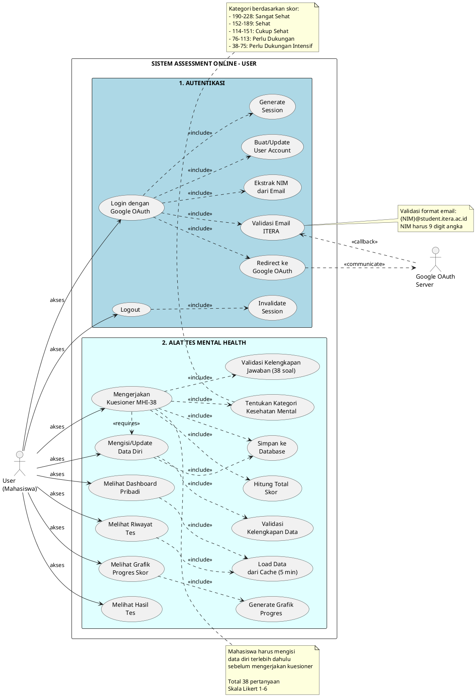
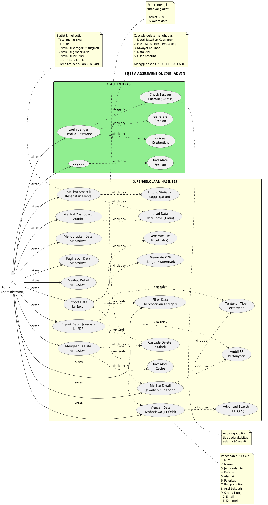

# Use Case Diagram - Assessment Online ITERA

**Platform Asesmen Kesehatan Mental Mahasiswa ITERA**
**Tanggal:** 28 November 2025
**Versi:** 2.0 - Synchronized with bab3-use-case-diagram-explanation.md

---

## Daftar Isi

1. [Pendahuluan](#1-pendahuluan)
2. [Use Case Diagram User (Mahasiswa)](#2-use-case-diagram-user-mahasiswa)
3. [Use Case Diagram Admin (Administrator)](#3-use-case-diagram-admin-administrator)
4. [Daftar Lengkap Use Case](#4-daftar-lengkap-use-case)
5. [Relasi Antar Use Case](#5-relasi-antar-use-case)

---

## 1. Pendahuluan

### 1.1 Tujuan Dokumen
Dokumen ini menjelaskan use case diagram untuk sistem Assessment Online ITERA yang dibagi menjadi 2 diagram terpisah berdasarkan aktor:
1. **Use Case Diagram User (Mahasiswa)** - Semua fitur yang dapat diakses mahasiswa
2. **Use Case Diagram Admin (Administrator)** - Semua fitur yang dapat diakses administrator

### 1.2 Aktor Sistem
- **User (Mahasiswa)**: Mahasiswa ITERA yang menggunakan sistem untuk mengisi kuesioner kesehatan mental dan melihat hasil pribadi
- **Admin (Administrator)**: Administrator yang mengelola dan memonitor data kesehatan mental seluruh mahasiswa

### 1.3 Sistem Eksternal
- **Google OAuth Server**: Server Google yang menyediakan layanan autentikasi OAuth 2.0 untuk User

### 1.4 Pembagian Fungsional
Sistem dibagi menjadi 3 bagian fungsional utama:
1. **Autentikasi** - Proses login dan logout
2. **Alat Tes Mental Health** - Fitur untuk mengisi dan melihat hasil tes (User only)
3. **Pengelolaan Hasil Tes** - Fitur untuk monitoring dan manajemen data (Admin only)

---

## 2. Use Case Diagram User (Mahasiswa)

### 2.1 Diagram PlantUML - User



### 2.2 Deskripsi Use Case User

#### A. Autentikasi (2 use case)

| ID | Nama Use Case | Deskripsi | Prasyarat | Hasil |
|----|---------------|-----------|-----------|-------|
| UC_U_Login | Login dengan Google OAuth | Mahasiswa login menggunakan akun Google ITERA untuk mengakses sistem | Email format: `{NIM}@student.itera.ac.id` | Session aktif 120 menit, redirect ke dashboard |
| UC_U_Logout | Logout | Mahasiswa keluar dari sistem dan mengakhiri session | Sudah login | Session dihapus, redirect ke halaman login |

#### B. Dashboard (3 use case)

| ID | Nama Use Case | Deskripsi | Prasyarat | Hasil |
|----|---------------|-----------|-----------|-------|
| UC_U_Dashboard | Melihat Dashboard Pribadi | Mahasiswa melihat ringkasan statistik tes mereka | Sudah login | Tampil total tes, kategori terakhir, grafik, riwayat |
| UC_U_History | Melihat Riwayat Tes | Mahasiswa melihat semua riwayat tes yang pernah dikerjakan | Sudah login, minimal 1 tes | Tampil tabel riwayat dengan tanggal, skor, kategori |
| UC_U_Chart | Melihat Grafik Progres Skor | Mahasiswa melihat grafik line chart trend skor | Sudah login, minimal 2 tes | Tampil grafik progres skor dari waktu ke waktu |

#### C. Pengisian Tes (3 use case)

| ID | Nama Use Case | Deskripsi | Prasyarat | Hasil |
|----|---------------|-----------|-----------|-------|
| UC_U_DataDiri | Mengisi/Update Data Diri | Mahasiswa mengisi atau memperbarui data pribadi dan akademik | Sudah login | Data tersimpan, redirect ke kuesioner |
| UC_U_Kuesioner | Mengerjakan Kuesioner MHI-38 | Mahasiswa menjawab 38 pertanyaan dengan skala 1-6 | Data diri lengkap | Skor dan kategori tersimpan, redirect ke hasil |
| UC_U_Result | Melihat Hasil Tes | Mahasiswa melihat hasil tes terbaru dengan interpretasi | Sudah submit kuesioner | Tampil skor, kategori, interpretasi, rekomendasi |

---

## 3. Use Case Diagram Admin (Administrator)

### 3.1 Diagram PlantUML - Admin



### 3.2 Deskripsi Use Case Admin

#### A. Autentikasi (2 use case)

| ID | Nama Use Case | Deskripsi | Prasyarat | Hasil |
|----|---------------|-----------|-----------|-------|
| UC_A_Login | Login dengan Email & Password | Administrator login menggunakan email dan password untuk akses dashboard | Kredensial valid di database | Session aktif 120 menit, auto-logout 30 menit idle |
| UC_A_Logout | Logout | Administrator keluar dari sistem dan mengakhiri session | Sudah login | Session dihapus, redirect ke halaman login |

#### B. Dashboard & Statistik (2 use case)

| ID | Nama Use Case | Deskripsi | Prasyarat | Hasil |
|----|---------------|-----------|-----------|-------|
| UC_A_Dashboard | Melihat Dashboard Admin | Admin melihat dashboard dengan statistik dan tabel data mahasiswa | Sudah login sebagai admin | Tampil statistik, grafik, tabel data mahasiswa |
| UC_A_Stats | Melihat Statistik Kesehatan Mental | Admin melihat statistik lengkap: total, distribusi, trend | Sudah login sebagai admin | Tampil kartu statistik dan grafik visualisasi |

#### C. Pencarian & Filter (4 use case)

| ID | Nama Use Case | Deskripsi | Prasyarat | Hasil |
|----|---------------|-----------|-----------|-------|
| UC_A_Search | Mencari Data Mahasiswa | Admin mencari data mahasiswa di 11 field dengan kata kunci | Sudah login | Tampil hasil pencarian yang sesuai keyword |
| UC_A_Filter | Filter Data berdasarkan Kategori | Admin memfilter data berdasarkan 5 kategori kesehatan mental | Sudah login | Tampil data mahasiswa sesuai kategori terpilih |
| UC_A_Sort | Mengurutkan Data Mahasiswa | Admin mengurutkan data berdasarkan kolom (NIM, Nama, Skor, dll) | Sudah login | Data terurut sesuai kolom dan arah (ASC/DESC) |
| UC_A_Pagination | Pagination Data Mahasiswa | Admin mengatur jumlah data per halaman (10/25/50/100) | Sudah login | Data terbagi per halaman dengan navigasi |

#### D. Management Data (5 use case)

| ID | Nama Use Case | Deskripsi | Prasyarat | Hasil |
|----|---------------|-----------|-----------|-------|
| UC_A_Detail | Melihat Detail Mahasiswa | Admin melihat detail lengkap 1 mahasiswa (4 tab: data diri, keluhan, hasil tes, grafik) | Sudah login | Modal popup dengan detail lengkap mahasiswa |
| UC_A_DetailJawaban | Melihat Detail Jawaban Kuesioner | Admin melihat semua 38 pertanyaan dan jawaban spesifik mahasiswa dengan badge tipe (positif/negatif) | Sudah login | Tabel 38 pertanyaan + jawaban + tipe dengan color-coding |
| UC_A_Export | Export Data ke Excel | Admin mengexport data mahasiswa ke file Excel (.xlsx) dengan 16 kolom, merespect filter/search yang aktif | Sudah login | File Excel terdownload dengan format rapi |
| UC_A_ExportPDF | Export Detail Jawaban ke PDF | Admin mengexport detail jawaban 38 item ke PDF dengan watermark "Generated by ANALOGY - ITERA" | Sudah login, ada hasil tes | File PDF terdownload dengan layout profesional |
| UC_A_Delete | Menghapus Data Mahasiswa | Admin menghapus semua data mahasiswa secara permanen (cascade 5 tabel) | Sudah login | Data terhapus, cache di-invalidate, dashboard refresh |

---

## 4. Daftar Lengkap Use Case

### 4.1 Ringkasan Total Use Case

| Kategori | User | Admin | Sistem | Total |
|----------|------|-------|--------|-------|
| **Autentikasi** | 2 | 2 | 8 | 12 |
| **Alat Tes Mental Health** | 6 | 0 | 7 | 13 |
| **Pengelolaan Hasil Tes** | 0 | 11 | 8 | 19 |
| **TOTAL** | **8** | **13** | **23** | **44** |

### 4.2 Use Case User (Mahasiswa) - Total: 8

#### Autentikasi (2):
1. UC_U_Login - Login dengan Google OAuth
2. UC_U_Logout - Logout

#### Dashboard (3):
3. UC_U_Dashboard - Melihat Dashboard Pribadi
4. UC_U_History - Melihat Riwayat Tes
5. UC_U_Chart - Melihat Grafik Progres Skor

#### Pengisian Tes (3):
6. UC_U_DataDiri - Mengisi/Update Data Diri
7. UC_U_Kuesioner - Mengerjakan Kuesioner MHI-38
8. UC_U_Result - Melihat Hasil Tes

---

### 4.3 Use Case Admin (Administrator) - Total: 13

#### Autentikasi (2):
1. UC_A_Login - Login dengan Email & Password
2. UC_A_Logout - Logout

#### Dashboard & Statistik (2):
3. UC_A_Dashboard - Melihat Dashboard Admin
4. UC_A_Stats - Melihat Statistik Kesehatan Mental

#### Pencarian & Filter (4):
5. UC_A_Search - Mencari Data Mahasiswa (11 field)
6. UC_A_Filter - Filter Data berdasarkan Kategori
7. UC_A_Sort - Mengurutkan Data Mahasiswa
8. UC_A_Pagination - Pagination Data Mahasiswa

#### Management Data (5):
9. UC_A_Detail - Melihat Detail Mahasiswa
10. UC_A_DetailJawaban - Melihat Detail Jawaban Kuesioner ⭐ NEW
11. UC_A_Export - Export Data ke Excel
12. UC_A_ExportPDF - Export Detail Jawaban ke PDF ⭐ NEW
13. UC_A_Delete - Menghapus Data Mahasiswa

---

### 4.4 Use Case Sistem (Internal) - Total: 23

#### Untuk User (13):
**Autentikasi User (6):**
1. UC_S_Redirect - Redirect ke Google OAuth
2. UC_S_ValidEmail - Validasi Email ITERA
3. UC_S_ExtractNIM - Ekstrak NIM dari Email
4. UC_S_CreateUser - Buat/Update User Account
5. UC_S_GenSession - Generate Session
6. UC_S_InvalidSession - Invalidate Session

**Alat Tes (7):**
7. UC_S_ValidData - Validasi Kelengkapan Data
8. UC_S_ValidAnswer - Validasi Kelengkapan Jawaban (38 soal)
9. UC_S_CalcScore - Hitung Total Skor
10. UC_S_Category - Tentukan Kategori Kesehatan Mental
11. UC_S_Save - Simpan ke Database
12. UC_S_GenChart - Generate Grafik Progres
13. UC_S_CacheUser - Load Data dari Cache (5 min)

#### Untuk Admin (10):
**Autentikasi Admin (3):**
14. UC_S_ValidCred - Validasi Credentials
15. UC_S_GenSession - Generate Session (shared dengan User)
16. UC_S_Timeout - Check Session Timeout (30 min)
17. UC_S_InvalidSession - Invalidate Session (shared dengan User)

**Pengelolaan Data (7):**
18. UC_S_CacheAdmin - Load Data dari Cache (1 min)
19. UC_S_AdvSearch - Advanced Search (LEFT JOIN)
20. UC_S_Aggregation - Hitung Statistik (aggregation)
21. UC_S_GenExcel - Generate File Excel (.xlsx)
22. UC_S_Get38Questions - Ambil 38 Pertanyaan ⭐ NEW
23. UC_S_DeterminineType - Tentukan Tipe Pertanyaan (Positif/Negatif) ⭐ NEW
24. UC_S_GenPDF - Generate PDF dengan Watermark ⭐ NEW
25. UC_S_Cascade - Cascade Delete (5 tabel)
26. UC_S_InvalCache - Invalidate Cache

---

## 5. Relasi Antar Use Case

### 5.1 Jenis Relasi

#### Include (<<include>>)
Use case utama **selalu membutuhkan** use case lain untuk berjalan.

**Contoh:**
- `Login dengan Google OAuth` **include** `Validasi Email ITERA`
- `Mengerjakan Kuesioner` **include** `Hitung Total Skor`
- `Menghapus Data Mahasiswa` **include** `Cascade Delete`

#### Extend (<<extend>>)
Use case lain **opsional** memperluas fungsionalitas use case utama.

**Contoh:**
- `Export Data ke Excel` **extend** `Mencari Data Mahasiswa` (export bisa dengan/tanpa search)
- `Export Data ke Excel` **extend** `Filter Data berdasarkan Kategori` (export bisa dengan/tanpa filter)

#### Requires (<<requires>>)
Use case memerlukan use case lain **selesai terlebih dahulu**.

**Contoh:**
- `Mengerjakan Kuesioner` **requires** `Mengisi Data Diri` (data diri harus diisi dulu)

#### Communicate (<<communicate>>)
Sistem berkomunikasi dengan **aktor eksternal**.

**Contoh:**
- `Redirect ke Google OAuth` **communicate** `Google OAuth Server`

#### Trigger (<<trigger>>)
Use case memicu use case lain untuk berjalan.

**Contoh:**
- `Login dengan Email & Password` **trigger** `Check Session Timeout`

---

### 5.2 Tabel Relasi Use Case

#### A. Relasi User

| Use Case Utama | Jenis Relasi | Use Case Terkait |
|----------------|--------------|------------------|
| Login dengan Google OAuth | include | Redirect ke Google OAuth |
| Login dengan Google OAuth | include | Validasi Email ITERA |
| Login dengan Google OAuth | include | Ekstrak NIM dari Email |
| Login dengan Google OAuth | include | Buat/Update User Account |
| Login dengan Google OAuth | include | Generate Session |
| Logout (User) | include | Invalidate Session |
| Melihat Dashboard Pribadi | include | Load Data dari Cache (5 min) |
| Melihat Riwayat Tes | include | Load Data dari Cache (5 min) |
| Melihat Grafik Progres | include | Generate Grafik Progres |
| Mengisi/Update Data Diri | include | Validasi Kelengkapan Data |
| Mengisi/Update Data Diri | include | Simpan ke Database |
| Mengerjakan Kuesioner MHI-38 | requires | Mengisi/Update Data Diri |
| Mengerjakan Kuesioner MHI-38 | include | Validasi Kelengkapan Jawaban |
| Mengerjakan Kuesioner MHI-38 | include | Hitung Total Skor |
| Mengerjakan Kuesioner MHI-38 | include | Tentukan Kategori |
| Mengerjakan Kuesioner MHI-38 | include | Simpan ke Database |

#### B. Relasi Admin

| Use Case Utama | Jenis Relasi | Use Case Terkait |
|----------------|--------------|------------------|
| Login dengan Email & Password | include | Validasi Credentials |
| Login dengan Email & Password | include | Generate Session |
| Login dengan Email & Password | trigger | Check Session Timeout (30 min) |
| Logout (Admin) | include | Invalidate Session |
| Melihat Dashboard Admin | include | Load Data dari Cache (1 min) |
| Melihat Statistik | include | Hitung Statistik (aggregation) |
| Melihat Statistik | include | Load Data dari Cache (1 min) |
| Mencari Data Mahasiswa | include | Advanced Search (LEFT JOIN) |
| Melihat Detail Jawaban Kuesioner | include | Ambil 38 Pertanyaan ⭐ NEW |
| Melihat Detail Jawaban Kuesioner | include | Tentukan Tipe Pertanyaan ⭐ NEW |
| Export Detail Jawaban ke PDF | extend | Melihat Detail Jawaban Kuesioner ⭐ NEW |
| Export Detail Jawaban ke PDF | include | Ambil 38 Pertanyaan ⭐ NEW |
| Export Detail Jawaban ke PDF | include | Tentukan Tipe Pertanyaan ⭐ NEW |
| Export Detail Jawaban ke PDF | include | Generate PDF dengan Watermark ⭐ NEW |
| Export Data ke Excel | extend | Mencari Data Mahasiswa |
| Export Data ke Excel | extend | Filter Data berdasarkan Kategori |
| Export Data ke Excel | include | Generate File Excel (.xlsx) |
| Menghapus Data Mahasiswa | include | Cascade Delete (5 tabel) |
| Menghapus Data Mahasiswa | include | Invalidate Cache |

---

## 6. Perbandingan Fitur User vs Admin

### 6.1 Tabel Perbandingan

| Fitur | User | Admin | Keterangan |
|-------|------|-------|------------|
| **Autentikasi** | ✓ Google OAuth | ✓ Email/Password | Metode berbeda |
| **Session Timeout** | ✗ Tidak ada | ✓ 30 menit idle | Admin lebih ketat |
| **Dashboard** | ✓ Dashboard Pribadi | ✓ Dashboard Admin | Data berbeda |
| **Statistik** | ✓ Statistik pribadi | ✓ Statistik semua mahasiswa | Scope berbeda |
| **Isi Data Diri** | ✓ Dapat isi/edit | ✗ Tidak dapat | User only |
| **Isi Kuesioner** | ✓ Dapat isi | ✗ Tidak dapat | User only |
| **Lihat Hasil Tes** | ✓ Hasil pribadi | ✓ Hasil semua mahasiswa | Scope berbeda |
| **Riwayat Tes** | ✓ Riwayat pribadi | ✓ Riwayat semua mahasiswa | Scope berbeda |
| **Grafik Progres** | ✓ Grafik pribadi | ✓ Grafik per mahasiswa | Scope berbeda |
| **Pencarian** | ✗ Tidak ada | ✓ Search 11 field | Admin only |
| **Filter Kategori** | ✗ Tidak ada | ✓ Filter 5 kategori | Admin only |
| **Sort & Pagination** | ✗ Tidak ada | ✓ Sort & Pagination | Admin only |
| **Detail Jawaban 38 Item** | ✗ Tidak ada | ✓ View dengan color-coding ⭐ NEW | Admin only |
| **Export Excel** | ✗ Tidak ada | ✓ Export 16 kolom | Admin only |
| **Export Detail Jawaban PDF** | ✗ Tidak ada | ✓ Export dengan watermark ⭐ NEW | Admin only |
| **Delete Data** | ✗ Tidak dapat | ✓ Cascade delete | Admin only |

### 6.2 Kesimpulan Perbandingan

**User (Mahasiswa):**
- Fokus pada **input data** (data diri, kuesioner)
- Fokus pada **viewing data pribadi** (dashboard, hasil, riwayat, grafik)
- **Tidak ada** fitur management atau pengelolaan data

**Admin (Administrator):**
- Fokus pada **monitoring** (dashboard, statistik)
- Fokus pada **data management** (search, filter, sort, export, delete)
- **Tidak dapat** isi kuesioner atau data diri
- Memiliki **akses ke semua data** mahasiswa

---

## 7. Catatan Implementasi

### 7.1 File Controller Terkait

**User (Mahasiswa):**
- `app/Http/Controllers/AuthController.php` - Google OAuth Login
- `app/Http/Controllers/DashboardController.php` - Dashboard User
- `app/Http/Controllers/DataDirisController.php` - Form Data Diri
- `app/Http/Controllers/HasilKuesionerController.php` - Kuesioner & Scoring

**Admin (Administrator):**
- `app/Http/Controllers/Auth/AdminAuthController.php` - Admin Login/Logout
- `app/Http/Controllers/HasilKuesionerCombinedController.php` - Dashboard Admin, Search, Export, Delete
- `app/Http/Controllers/StatistikController.php` - Statistik

**Middleware:**
- `app/Http/Middleware/AdminAuth.php` - Session Timeout Check (30 min)

### 7.2 Routes Mapping

**User Routes (middleware: auth):**
```php
GET  /user/mental-health            → Dashboard User
GET  /mental-health/isi-data-diri   → Form Data Diri
POST /mental-health/isi-data-diri   → Submit Data Diri
GET  /mental-health/kuesioner       → Form Kuesioner
POST /mental-health/kuesioner       → Submit Kuesioner
POST /logout                        → Logout User
```

**Admin Routes (middleware: AdminAuth):**
```php
GET    /admin/mental-health         → Dashboard Admin
GET    /admin/mental-health/export  → Export Excel
DELETE /admin/mental-health/{id}    → Delete Data
GET    /statistik/total-users       → Get Statistics
POST   /logout                      → Logout Admin
```

### 7.3 Database Schema

| Tabel | Primary Key | Foreign Key | Relasi |
|-------|-------------|-------------|--------|
| users | nim | - | One-to-One dengan data_diris |
| admins | id | - | - |
| data_diris | nim | users.nim | One-to-Many dengan riwayat_keluhans, hasil_kuesioners |
| riwayat_keluhans | id | data_diris.nim | Many-to-One dengan data_diris |
| hasil_kuesioners | id | data_diris.nim | Many-to-One dengan data_diris |
| sessions | id | - | - |

---

## 8. Cara Render Diagram

### 8.1 Online Tools
1. **PlantUML Online Editor**: http://www.plantuml.com/plantuml/uml/
2. **PlantText**: https://www.planttext.com/
3. **PlantUML QEditor**: https://plantuml-editor.kkeisuke.com/

### 8.2 Langkah-Langkah:
1. Buka salah satu online tool di atas
2. Copy code PlantUML dari bagian "2.1 Diagram PlantUML - User" atau "3.1 Diagram PlantUML - Admin"
3. Paste ke editor
4. Klik "Generate" atau "Submit"
5. Download gambar PNG/SVG untuk dokumentasi

### 8.3 VS Code Extension
1. Install extension "PlantUML" by jebbs
2. Install Graphviz dari https://graphviz.org/download/
3. Buka file `.md` ini di VS Code
4. Tekan `Alt+D` untuk preview diagram

### 8.4 Command Line
```bash
# Install PlantUML
brew install plantuml  # macOS
# atau
sudo apt install plantuml  # Ubuntu

# Generate PNG
plantuml USE_CASE_DIAGRAM.md

# Generate SVG
plantuml -tsvg USE_CASE_DIAGRAM.md
```

---

## 9. Changelog

### Version 2.0 (28 November 2025)
**UPDATE SINKRONISASI DENGAN BAB 3 PENJELASAN USE CASE**

**Fitur Baru yang Ditambahkan:**
- ✅ UC_A_DetailJawaban - Melihat Detail Jawaban Kuesioner (UC17_NEW)
- ✅ UC_A_ExportPDF - Export Detail Jawaban ke PDF (UC18_NEW)
- ✅ UC_S_Get38Questions - Ambil 38 Pertanyaan (UC22_NEW)
- ✅ UC_S_DeterminineType - Tentukan Tipe Pertanyaan (UC23_NEW)
- ✅ UC_S_GenPDF - Generate PDF dengan Watermark (UC24_NEW)

**Perubahan yang Dilakukan:**
- Total use case Admin: 11 → 13 (tambah 2)
- Total system use cases: 21 → 23 (tambah 2)
- Total keseluruhan: 40 → 44 use case
- Cascade delete: 4 tabel → 5 tabel (tambah detail_jawaban_details)
- Update semua relasi dan tabel deskripsi

**Sinkronisasi dengan:**
- File: bab3-use-case-diagram-explanation.md (21 Nov 2025)
- Memastikan semua fitur dan deskripsi konsisten

### Version 1.0 (11 November 2025)
- Initial release dengan 40 use case total
- Pembagian 2 diagram terpisah (User & Admin)

---

**Dokumen Dibuat:** 11 November 2025
**Terakhir Diupdate:** 28 November 2025
**Versi:** 2.0
**Status:** Synchronized with bab3-use-case-diagram-explanation.md
**Institut Teknologi Sumatera (ITERA)**

---

**END OF DOCUMENT**
