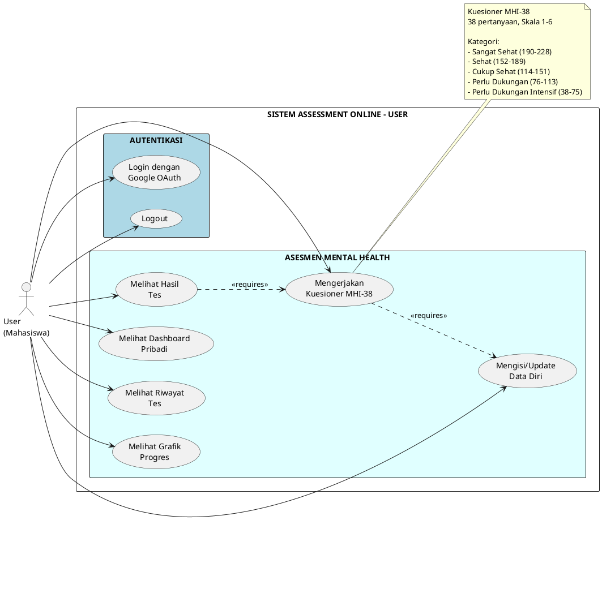
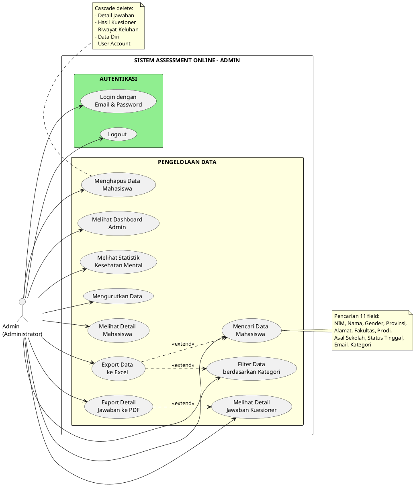

# Use Case Diagram - Assessment Online ITERA
## Versi Sederhana (Simplified)

**Platform Asesmen Kesehatan Mental Mahasiswa ITERA**
**Tanggal:** 28 November 2025
**Versi:** 3.0 - Simplified Version

---

## 📑 Daftar Isi

1. [Pendahuluan](#pendahuluan)
2. [Use Case Diagram User (Mahasiswa)](#use-case-diagram-user-mahasiswa)
3. [Use Case Diagram Admin (Administrator)](#use-case-diagram-admin-administrator)
4. [Ringkasan Use Case](#ringkasan-use-case)
5. [Cara Render Diagram](#cara-render-diagram)

---

## 1. Pendahuluan

### 1.1 Tujuan Dokumen
Dokumen ini menjelaskan use case diagram untuk sistem Assessment Online ITERA secara sederhana, fokus pada fitur-fitur utama yang dapat diakses oleh pengguna tanpa detail teknis implementasi.

### 1.2 Aktor Sistem
- **User (Mahasiswa)**: Mahasiswa ITERA yang menggunakan sistem untuk melakukan asesmen kesehatan mental pribadi
- **Admin (Administrator)**: Administrator yang mengelola dan memonitor data kesehatan mental seluruh mahasiswa

### 1.3 Kategori Fitur
- **Autentikasi** - Login dan logout untuk akses sistem
- **Asesmen Mental Health** - Mengisi kuesioner dan melihat hasil (User)
- **Pengelolaan Data** - Monitoring, pencarian, dan manajemen data (Admin)

---

## 2. Use Case Diagram User (Mahasiswa)

### 2.1 Diagram User



### 2.2 Deskripsi Use Case User

| No | Use Case | Deskripsi | Prasyarat |
|----|----------|-----------|-----------|
| 1 | Login dengan Google OAuth | Mahasiswa login menggunakan akun Google ITERA | Email: `{NIM}@student.itera.ac.id` |
| 2 | Logout | Mahasiswa keluar dari sistem | Sudah login |
| 3 | Melihat Dashboard Pribadi | Melihat ringkasan statistik tes pribadi | Sudah login |
| 4 | Melihat Riwayat Tes | Melihat semua tes yang pernah dikerjakan | Sudah login |
| 5 | Melihat Grafik Progres | Melihat grafik trend skor dari waktu ke waktu | Sudah login, minimal 2 tes |
| 6 | Mengisi Data Diri | Mengisi data pribadi dan akademik | Sudah login |
| 7 | Mengerjakan Kuesioner MHI-38 | Menjawab 38 pertanyaan skala 1-6 | Data diri sudah lengkap |
| 8 | Melihat Hasil Tes | Melihat hasil tes dengan interpretasi | Sudah submit kuesioner |

### 2.3 Alur Penggunaan User

```
1. Login dengan Google OAuth
   ↓
2. Mengisi/Update Data Diri (wajib)
   ↓
3. Mengerjakan Kuesioner MHI-38
   ↓
4. Melihat Hasil Tes
   ↓
5. Melihat Dashboard Pribadi / Riwayat / Grafik Progres
```

---

## 3. Use Case Diagram Admin (Administrator)

### 3.1 Diagram Admin



### 3.2 Deskripsi Use Case Admin

| No | Use Case | Deskripsi | Prasyarat |
|----|----------|-----------|-----------|
| 1 | Login dengan Email & Password | Admin login untuk akses dashboard | Kredensial valid |
| 2 | Logout | Admin keluar dari sistem | Sudah login |
| 3 | Melihat Dashboard Admin | Melihat statistik dan tabel data mahasiswa | Sudah login |
| 4 | Melihat Statistik | Melihat statistik lengkap: total, distribusi, trend | Sudah login |
| 5 | Mencari Data Mahasiswa | Mencari data mahasiswa di 11 field | Sudah login |
| 6 | Filter Data berdasarkan Kategori | Memfilter data berdasarkan 5 kategori | Sudah login |
| 7 | Mengurutkan Data | Mengurutkan data berdasarkan kolom tertentu | Sudah login |
| 8 | Melihat Detail Mahasiswa | Melihat detail lengkap 1 mahasiswa | Sudah login |
| 9 | Melihat Detail Jawaban Kuesioner | Melihat 38 pertanyaan dan jawaban mahasiswa | Sudah login |
| 10 | Export Data ke Excel | Export data mahasiswa ke file Excel | Sudah login |
| 11 | Export Detail Jawaban ke PDF | Export detail jawaban 38 item ke PDF | Sudah login |
| 12 | Menghapus Data Mahasiswa | Menghapus data mahasiswa secara permanen | Sudah login |

### 3.3 Alur Penggunaan Admin

```
1. Login dengan Email & Password
   ↓
2. Melihat Dashboard Admin / Statistik
   ↓
3. Mencari / Filter / Mengurutkan Data (opsional)
   ↓
4. Melihat Detail Mahasiswa
   ↓
5. Melihat Detail Jawaban Kuesioner (opsional)
   ↓
6. Export Data (Excel/PDF) atau Menghapus Data
```

---

## 4. Ringkasan Use Case

### 4.1 Total Use Case

| Aktor | Jumlah Use Case | Kategori |
|-------|-----------------|----------|
| **User (Mahasiswa)** | 8 | Autentikasi (2), Asesmen (6) |
| **Admin (Administrator)** | 12 | Autentikasi (2), Pengelolaan (10) |
| **TOTAL** | **20** | - |

### 4.2 Use Case User (8)

**Autentikasi:**
1. Login dengan Google OAuth
2. Logout

**Asesmen Mental Health:**
3. Melihat Dashboard Pribadi
4. Melihat Riwayat Tes
5. Melihat Grafik Progres
6. Mengisi/Update Data Diri
7. Mengerjakan Kuesioner MHI-38
8. Melihat Hasil Tes

### 4.3 Use Case Admin (12)

**Autentikasi:**
1. Login dengan Email & Password
2. Logout

**Pengelolaan Data:**
3. Melihat Dashboard Admin
4. Melihat Statistik Kesehatan Mental
5. Mencari Data Mahasiswa
6. Filter Data berdasarkan Kategori
7. Mengurutkan Data
8. Melihat Detail Mahasiswa
9. Melihat Detail Jawaban Kuesioner
10. Export Data ke Excel
11. Export Detail Jawaban ke PDF
12. Menghapus Data Mahasiswa

### 4.4 Perbedaan Fitur User vs Admin

| Fitur | User | Admin |
|-------|------|-------|
| **Metode Login** | Google OAuth | Email & Password |
| **Isi Kuesioner** | ✓ Ya | ✗ Tidak |
| **Lihat Data Pribadi** | ✓ Ya (pribadi) | ✓ Ya (semua mahasiswa) |
| **Pencarian & Filter** | ✗ Tidak | ✓ Ya |
| **Export Data** | ✗ Tidak | ✓ Ya (Excel/PDF) |
| **Hapus Data** | ✗ Tidak | ✓ Ya |
| **Statistik** | ✓ Pribadi | ✓ Global |

---

## 5. Cara Render Diagram

### 5.1 Online Tools (Recommended)

**1. PlantUML Online Editor**
- URL: http://www.plantuml.com/plantuml/uml/
- Langkah:
  1. Buka website
  2. Copy code PlantUML dari diagram User atau Admin
  3. Paste ke editor
  4. Klik "Generate" atau tekan Submit
  5. Download gambar PNG/SVG

**2. PlantText**
- URL: https://www.planttext.com/
- Langkah sama seperti di atas

### 5.2 VS Code Extension

1. Install extension **"PlantUML"** by jebbs
2. Install **Graphviz**: https://graphviz.org/download/
3. Buka file `.md` ini di VS Code
4. Tekan `Alt+D` untuk preview diagram
5. Klik kanan pada preview → Export → pilih format (PNG/SVG)

### 5.3 Command Line

```bash
# Install PlantUML (macOS)
brew install plantuml

# Install PlantUML (Ubuntu/Debian)
sudo apt install plantuml

# Generate PNG
plantuml USE_CASE_DIAGRAM_SIMPLE.md

# Generate SVG
plantuml -tsvg USE_CASE_DIAGRAM_SIMPLE.md
```

---

## 📌 Catatan Penting

### Kategori Kesehatan Mental (5 tingkat)

| Skor | Kategori | Keterangan |
|------|----------|------------|
| 190-228 | Sangat Sehat | Kesehatan mental sangat baik |
| 152-189 | Sehat | Kesehatan mental baik |
| 114-151 | Cukup Sehat | Kesehatan mental cukup |
| 76-113 | Perlu Dukungan | Perlu konseling |
| 38-75 | Perlu Dukungan Intensif | Perlu konseling segera |

### Format Email Mahasiswa
```
{NIM}@student.itera.ac.id
```
Contoh: `121450001@student.itera.ac.id`

### Instrumen Asesmen
- **Nama:** MHI-38 (Mental Health Inventory-38)
- **Jumlah Pertanyaan:** 38 item
- **Skala:** Likert 1-6
- **Skor Minimum:** 38
- **Skor Maksimum:** 228

---

## 📝 Changelog

### Version 3.0 (28 November 2025) - Simplified Version
- ✅ Menghilangkan use case sistem internal (23 use case)
- ✅ Fokus pada use case yang diakses aktor langsung (20 use case)
- ✅ Diagram lebih sederhana dan mudah dipahami
- ✅ Menghapus detail teknis implementasi
- ✅ Menambahkan alur penggunaan untuk User dan Admin

### Version 2.0 (28 November 2025)
- Menambahkan fitur detail jawaban kuesioner
- Menambahkan export PDF
- Total 44 use case (termasuk sistem internal)

### Version 1.0 (11 November 2025)
- Initial release
- Total 40 use case

---

**Dokumen Dibuat:** 11 November 2025
**Terakhir Diupdate:** 28 November 2025
**Versi:** 3.0 - Simplified Version
**Status:** Final
**Institut Teknologi Sumatera (ITERA)**

---

**END OF DOCUMENT**
