# Use Case dan Activity Diagram - Mental Health Assessment System

## Daftar Isi

### Bagian 1: Autentikasi

1. [Use Case Diagram - Autentikasi](#use-case-diagram-autentikasi)
2. [Activity Diagram - Login Pengguna dengan Google OAuth](#activity-diagram-login-pengguna-dengan-google-oauth)
3. [Activity Diagram - Login Admin](#activity-diagram-login-admin)
4. [Activity Diagram - Logout](#activity-diagram-logout)
5. [Activity Diagram - Validasi Session Timeout Admin](#activity-diagram-validasi-session-timeout-admin)

### Bagian 2: Fitur Kesehatan Mental - Pengguna

6. [Use Case Diagram - Mental Health](#use-case-diagram-mental-health)
7. [Activity Diagram - Melihat Dasbor Pengguna](#activity-diagram-melihat-dasbor-pengguna)
8. [Activity Diagram - Mengisi Data Diri](#activity-diagram-mengisi-data-diri)
9. [Activity Diagram - Mengisi Kuesioner MHI-38](#activity-diagram-mengisi-kuesioner-mhi-38)
10. [Activity Diagram - Melihat Hasil Tes](#activity-diagram-melihat-hasil-tes)

### Bagian 3: Fitur Kesehatan Mental - Admin

11. [Activity Diagram - Melihat Dasbor Admin](#activity-diagram-melihat-dasbor-admin)
12. [Activity Diagram - Mencari dan Menyaring Data](#activity-diagram-mencari-dan-menyaring-data)
13. [Activity Diagram - Melihat Detail Mahasiswa](#activity-diagram-melihat-detail-mahasiswa)
14. [Activity Diagram - Melihat Detail Jawaban Kuesioner (NEW)](#activity-diagram-melihat-detail-jawaban-kuesioner)
15. [Activity Diagram - Mengekspor Detail Jawaban ke PDF (NEW)](#activity-diagram-mengekspor-detail-jawaban-ke-pdf)
16. [Activity Diagram - Mengekspor Data ke Excel](#activity-diagram-mengekspor-data-ke-excel)
17. [Activity Diagram - Menghapus Data Mahasiswa](#activity-diagram-menghapus-data-mahasiswa)

---

# BAGIAN 1: AUTENTIKASI

---

## Use Case Diagram Autentikasi

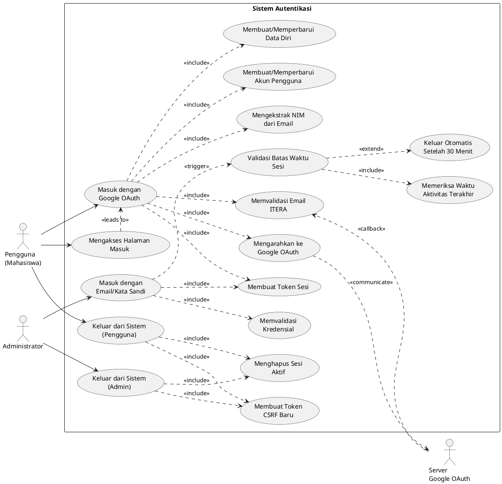
```plantuml
@startuml
left to right direction
skinparam packageStyle rectangle

actor "Pengguna\n(Mahasiswa)" as User
actor "Administrator" as Admin
actor "Server\nGoogle OAuth" as Google

rectangle "Sistem Autentikasi" {

  ' Use Case Autentikasi Pengguna
  usecase "Masuk dengan\nGoogle OAuth" as UC1
  usecase "Mengakses Halaman\nMasuk" as UC2
  usecase "Keluar dari Sistem\n(Pengguna)" as UC3

  ' Use Case Autentikasi Admin
  usecase "Masuk dengan\nEmail/Kata Sandi" as UC4
  usecase "Keluar dari Sistem\n(Admin)" as UC5
  usecase "Validasi Batas Waktu\nSesi" as UC6

  ' Use Case Sistem (included/extended)
  usecase "Mengarahkan ke\nGoogle OAuth" as UC7
  usecase "Memvalidasi Email\nITERA" as UC8
  usecase "Mengekstrak NIM\ndari Email" as UC9
  usecase "Membuat/Memperbarui\nAkun Pengguna" as UC10
  usecase "Membuat/Memperbarui\nData Diri" as UC11
  usecase "Membuat Token Sesi" as UC12
  usecase "Memvalidasi\nKredensial" as UC13
  usecase "Menghapus Sesi\nAktif" as UC14
  usecase "Membuat Token\nCSRF Baru" as UC15
  usecase "Memeriksa Waktu\nAktivitas Terakhir" as UC16
  usecase "Keluar Otomatis\nSetelah 30 Menit" as UC17
}

' Relasi Pengguna
User --> UC1
User --> UC2
User --> UC3

' Relasi Admin
Admin --> UC4
Admin --> UC5

' Relasi Google OAuth
UC1 ..> UC7 : <<include>>
UC7 ..> Google : <<communicate>>
Google ..> UC8 : <<callback>>

' Relasi Include untuk Login Pengguna
UC1 ..> UC8 : <<include>>
UC1 ..> UC9 : <<include>>
UC1 ..> UC10 : <<include>>
UC1 ..> UC11 : <<include>>
UC1 ..> UC12 : <<include>>

' Relasi Include untuk Login Admin
UC4 ..> UC13 : <<include>>
UC4 ..> UC12 : <<include>>

' Relasi Include untuk Logout
UC3 ..> UC14 : <<include>>
UC3 ..> UC15 : <<include>>
UC5 ..> UC14 : <<include>>
UC5 ..> UC15 : <<include>>

' Relasi Include untuk Session Timeout
UC6 ..> UC16 : <<include>>
UC6 ..> UC17 : <<extend>>
UC4 ..> UC6 : <<trigger>>

' Dependensi
UC2 .> UC1 : <<leads to>>

@enduml
```

---

## Activity Diagram: Login Pengguna dengan Google OAuth

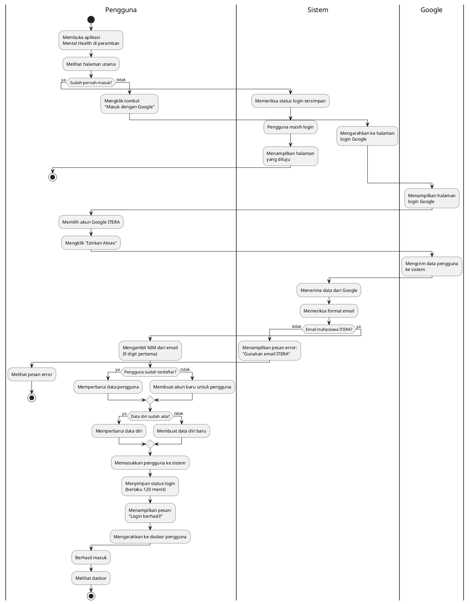
```plantuml
@startuml
|Pengguna|
start
:Membuka aplikasi\nMental Health di peramban;

:Melihat halaman utama;

if (Sudah pernah masuk?) then (ya)
  |Sistem|
  :Memeriksa status login tersimpan;
  :Pengguna masih login;
  :Menampilkan halaman\nyang dituju;
  |Pengguna|
  stop
else (tidak)
  :Mengklik tombol\n"Masuk dengan Google";

  |Sistem|
  :Mengarahkan ke halaman\nlogin Google;
endif

|Google|
:Menampilkan halaman\nlogin Google;

|Pengguna|
:Memilih akun Google ITERA;
:Mengklik "Izinkan Akses";

|Google|
:Mengirim data pengguna\nke sistem;

|Sistem|
:Menerima data dari Google;

:Memeriksa format email;

if (Email mahasiswa ITERA?) then (tidak)
  :Menampilkan pesan error:\n"Gunakan email ITERA";
  |Pengguna|
  :Melihat pesan error;
  stop
else (ya)
  :Mengambil NIM dari email\n(9 digit pertama);

  if (Pengguna sudah terdaftar?) then (ya)
    :Memperbarui data pengguna;
  else (tidak)
    :Membuat akun baru untuk pengguna;
  endif

  if (Data diri sudah ada?) then (ya)
    :Memperbarui data diri;
  else (tidak)
    :Membuat data diri baru;
  endif

  :Memasukkan pengguna ke sistem;

  :Menyimpan status login\n(berlaku 120 menit);

  :Menampilkan pesan:\n"Login berhasil!";

  :Mengarahkan ke dasbor pengguna;
endif

|Pengguna|
:Berhasil masuk;
:Melihat dasbor;

stop
@enduml
```

---

## Activity Diagram: Login Admin

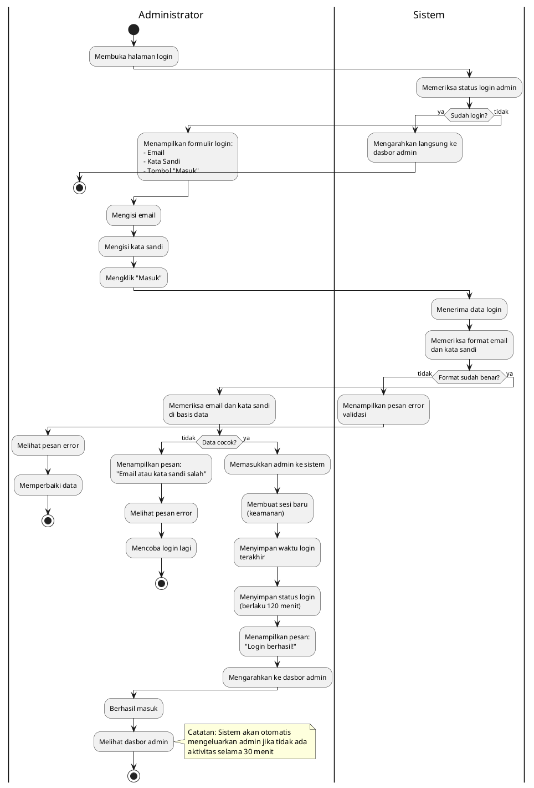
```plantuml
@startuml
|Administrator|
start
:Membuka halaman login;

|Sistem|
:Memeriksa status login admin;

if (Sudah login?) then (ya)
  :Mengarahkan langsung ke\ndasbor admin;
  |Administrator|
  stop
else (tidak)
  :Menampilkan formulir login:
  - Email
  - Kata Sandi
  - Tombol "Masuk";
endif

|Administrator|
:Mengisi email;
:Mengisi kata sandi;
:Mengklik "Masuk";

|Sistem|
:Menerima data login;

:Memeriksa format email\ndan kata sandi;

if (Format sudah benar?) then (tidak)
  :Menampilkan pesan error\nvalidasi;
  |Administrator|
  :Melihat pesan error;
  :Memperbaiki data;
  stop
else (ya)
  :Memeriksa email dan kata sandi\ndi basis data;

  if (Data cocok?) then (tidak)
    :Menampilkan pesan:\n"Email atau kata sandi salah";
    |Administrator|
    :Melihat pesan error;
    :Mencoba login lagi;
    stop
  else (ya)
    :Memasukkan admin ke sistem;

    :Membuat sesi baru\n(keamanan);

    :Menyimpan waktu login\nterakhir;

    :Menyimpan status login\n(berlaku 120 menit);

    :Menampilkan pesan:\n"Login berhasil!";

    :Mengarahkan ke dasbor admin;
  endif
endif

|Administrator|
:Berhasil masuk;
:Melihat dasbor admin;

note right
  Catatan: Sistem akan otomatis
  mengeluarkan admin jika tidak ada
  aktivitas selama 30 menit
end note

stop
@enduml
```

---

## Activity Diagram: Logout

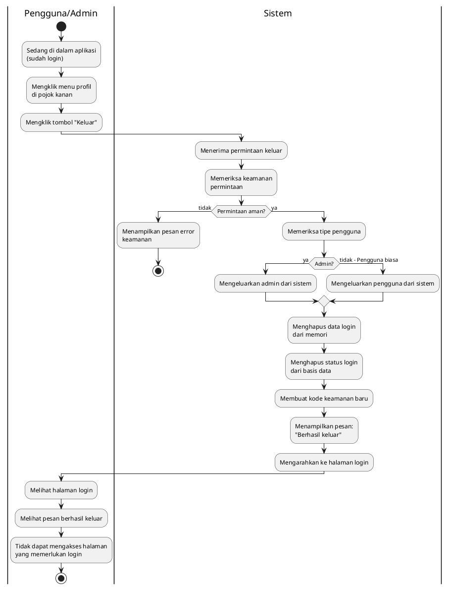
```plantuml
@startuml
|Pengguna/Admin|
start
:Sedang di dalam aplikasi\n(sudah login);

:Mengklik menu profil\ndi pojok kanan;

:Mengklik tombol "Keluar";

|Sistem|
:Menerima permintaan keluar;

:Memeriksa keamanan\npermintaan;

if (Permintaan aman?) then (tidak)
  :Menampilkan pesan error\nkeamanan;
  stop
else (ya)
  :Memeriksa tipe pengguna;

  if (Admin?) then (ya)
    :Mengeluarkan admin dari sistem;
  else (tidak - Pengguna biasa)
    :Mengeluarkan pengguna dari sistem;
  endif

  :Menghapus data login\ndari memori;

  :Menghapus status login\ndari basis data;

  :Membuat kode keamanan baru;

  :Menampilkan pesan:\n"Berhasil keluar";

  :Mengarahkan ke halaman login;
endif

|Pengguna/Admin|
:Melihat halaman login;

:Melihat pesan berhasil keluar;

:Tidak dapat mengakses halaman\nyang memerlukan login;

stop
@enduml
```

---

## Activity Diagram: Validasi Session Timeout Admin

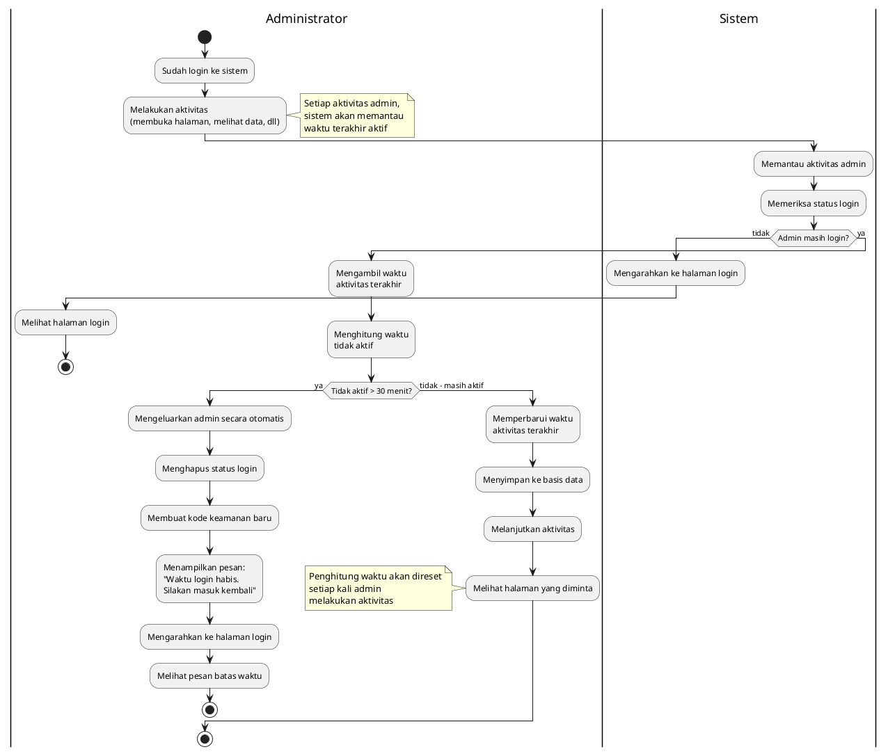
```plantuml
@startuml
|Administrator|
start
:Sudah login ke sistem;

:Melakukan aktivitas\n(membuka halaman, melihat data, dll);

note right
  Setiap aktivitas admin,
  sistem akan memantau
  waktu terakhir aktif
end note

|Sistem|
:Memantau aktivitas admin;

:Memeriksa status login;

if (Admin masih login?) then (tidak)
  :Mengarahkan ke halaman login;
  |Administrator|
  :Melihat halaman login;
  stop
else (ya)
  :Mengambil waktu\naktivitas terakhir;

  :Menghitung waktu\ntidak aktif;

  if (Tidak aktif > 30 menit?) then (ya)
    :Mengeluarkan admin secara otomatis;

    :Menghapus status login;

    :Membuat kode keamanan baru;

    :Menampilkan pesan:\n"Waktu login habis.\nSilakan masuk kembali";

    :Mengarahkan ke halaman login;

    |Administrator|
    :Melihat pesan batas waktu;
    stop
  else (tidak - masih aktif)
    :Memperbarui waktu\naktivitas terakhir;

    :Menyimpan ke basis data;

    :Melanjutkan aktivitas;

    |Administrator|
    :Melihat halaman yang diminta;

    note left
      Penghitung waktu akan direset
      setiap kali admin
      melakukan aktivitas
    end note
  endif
endif

stop
@enduml
```

---

# BAGIAN 2: FITUR KESEHATAN MENTAL - PENGGUNA

---

## Use Case Diagram Mental Health

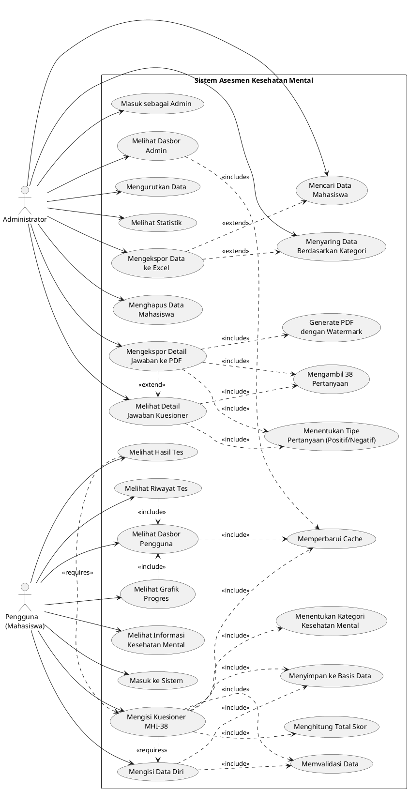
```plantuml
@startuml
left to right direction
skinparam packageStyle rectangle

actor "Pengguna\n(Mahasiswa)" as User
actor "Administrator" as Admin

rectangle "Sistem Asesmen Kesehatan Mental" {

  ' Use Case Pengguna
  usecase "Melihat Informasi\nKesehatan Mental" as UC1
  usecase "Masuk ke Sistem" as UC2
  usecase "Melihat Dasbor\nPengguna" as UC3
  usecase "Mengisi Data Diri" as UC4
  usecase "Mengisi Kuesioner\nMHI-38" as UC5
  usecase "Melihat Hasil Tes" as UC6
  usecase "Melihat Riwayat Tes" as UC7
  usecase "Melihat Grafik\nProgres" as UC8

  ' Use Case Admin
  usecase "Masuk sebagai Admin" as UC9
  usecase "Melihat Dasbor\nAdmin" as UC10
  usecase "Mencari Data\nMahasiswa" as UC11
  usecase "Menyaring Data\nBerdasarkan Kategori" as UC12
  usecase "Mengurutkan Data" as UC13
  usecase "Melihat Statistik" as UC14
  usecase "Mengekspor Data\nke Excel" as UC15
  usecase "Menghapus Data\nMahasiswa" as UC16
  usecase "Melihat Detail\nJawaban Kuesioner" as UC17_NEW
  usecase "Mengekspor Detail\nJawaban ke PDF" as UC18_NEW

  ' Use Case Sistem (included/extended)
  usecase "Memvalidasi Data" as UC17
  usecase "Menghitung Total Skor" as UC18
  usecase "Menentukan Kategori\nKesehatan Mental" as UC19
  usecase "Menyimpan ke Basis Data" as UC20
  usecase "Memperbarui Cache" as UC21
  usecase "Mengambil 38\nPertanyaan" as UC22_NEW
  usecase "Menentukan Tipe\nPertanyaan (Positif/Negatif)" as UC23_NEW
  usecase "Generate PDF\ndengan Watermark" as UC24_NEW
}

' Relasi Pengguna
User --> UC1
User --> UC2
User --> UC3
User --> UC4
User --> UC5
User --> UC6
User --> UC7
User --> UC8

' Relasi Admin
Admin --> UC9
Admin --> UC10
Admin --> UC11
Admin --> UC12
Admin --> UC13
Admin --> UC14
Admin --> UC15
Admin --> UC16
Admin --> UC17_NEW
Admin --> UC18_NEW

' Relasi Include
UC3 ..> UC21 : <<include>>
UC4 ..> UC17 : <<include>>
UC4 ..> UC20 : <<include>>
UC5 ..> UC17 : <<include>>
UC5 ..> UC18 : <<include>>
UC5 ..> UC19 : <<include>>
UC5 ..> UC20 : <<include>>
UC5 ..> UC21 : <<include>>
UC10 ..> UC21 : <<include>>
UC15 ..> UC11 : <<extend>>
UC15 ..> UC12 : <<extend>>

' Relasi Include untuk Fitur Detail Jawaban (NEW)
UC17_NEW ..> UC22_NEW : <<include>>
UC17_NEW ..> UC23_NEW : <<include>>
UC18_NEW ..> UC22_NEW : <<include>>
UC18_NEW ..> UC23_NEW : <<include>>
UC18_NEW ..> UC24_NEW : <<include>>

' Dependensi
UC5 .> UC4 : <<requires>>
UC6 .> UC5 : <<requires>>
UC7 .> UC3 : <<include>>
UC8 .> UC3 : <<include>>
UC18_NEW .> UC17_NEW : <<extend>>
@enduml
```

---

## Activity Diagram: Melihat Dasbor Pengguna

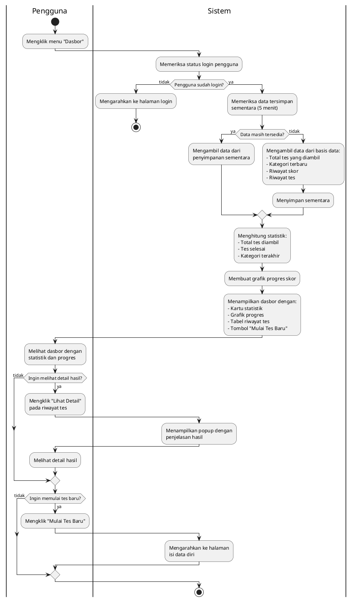
```plantuml
@startuml
|Pengguna|
start
:Mengklik menu "Dasbor";

|Sistem|
:Memeriksa status login pengguna;

if (Pengguna sudah login?) then (tidak)
  :Mengarahkan ke halaman login;
  stop
else (ya)
  :Memeriksa data tersimpan\nsementara (5 menit);

  if (Data masih tersedia?) then (ya)
    :Mengambil data dari\npenyimpanan sementara;
  else (tidak)
    :Mengambil data dari basis data:
    - Total tes yang diambil
    - Kategori terbaru
    - Riwayat skor
    - Riwayat tes;
    :Menyimpan sementara;
  endif

  :Menghitung statistik:
  - Total tes diambil
  - Tes selesai
  - Kategori terakhir;

  :Membuat grafik progres skor;

  :Menampilkan dasbor dengan:
  - Kartu statistik
  - Grafik progres
  - Tabel riwayat tes
  - Tombol "Mulai Tes Baru";
endif

|Pengguna|
:Melihat dasbor dengan\nstatistik dan progres;

if (Ingin melihat detail hasil?) then (ya)
  :Mengklik "Lihat Detail"\npada riwayat tes;
  |Sistem|
  :Menampilkan popup dengan\npenjelasan hasil;
  |Pengguna|
  :Melihat detail hasil;
else (tidak)
endif

if (Ingin memulai tes baru?) then (ya)
  :Mengklik "Mulai Tes Baru";
  |Sistem|
  :Mengarahkan ke halaman\nisi data diri;
else (tidak)
endif

stop
@enduml
```

---

## Activity Diagram: Mengisi Data Diri

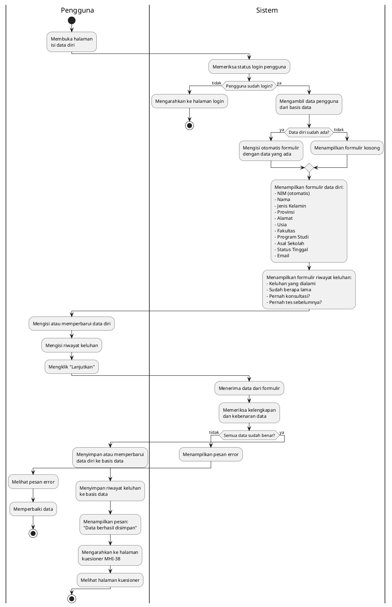
```plantuml
@startuml
|Pengguna|
start
:Membuka halaman\nisi data diri;

|Sistem|
:Memeriksa status login pengguna;

if (Pengguna sudah login?) then (tidak)
  :Mengarahkan ke halaman login;
  stop
else (ya)
  :Mengambil data pengguna\ndari basis data;

  if (Data diri sudah ada?) then (ya)
    :Mengisi otomatis formulir\ndengan data yang ada;
  else (tidak)
    :Menampilkan formulir kosong;
  endif

  :Menampilkan formulir data diri:
  - NIM (otomatis)
  - Nama
  - Jenis Kelamin
  - Provinsi
  - Alamat
  - Usia
  - Fakultas
  - Program Studi
  - Asal Sekolah
  - Status Tinggal
  - Email;

  :Menampilkan formulir riwayat keluhan:
  - Keluhan yang dialami
  - Sudah berapa lama
  - Pernah konsultasi?
  - Pernah tes sebelumnya?;
endif

|Pengguna|
:Mengisi atau memperbarui data diri;
:Mengisi riwayat keluhan;
:Mengklik "Lanjutkan";

|Sistem|
:Menerima data dari formulir;

:Memeriksa kelengkapan\ndan kebenaran data;

if (Semua data sudah benar?) then (tidak)
  :Menampilkan pesan error;
  |Pengguna|
  :Melihat pesan error;
  :Memperbaiki data;
  stop
else (ya)
  :Menyimpan atau memperbarui\ndata diri ke basis data;

  :Menyimpan riwayat keluhan\nke basis data;

  :Menampilkan pesan:\n"Data berhasil disimpan";

  :Mengarahkan ke halaman\nkuesioner MHI-38;

  |Pengguna|
  :Melihat halaman kuesioner;
endif

stop
@enduml
```

---

## Activity Diagram: Mengisi Kuesioner MHI-38

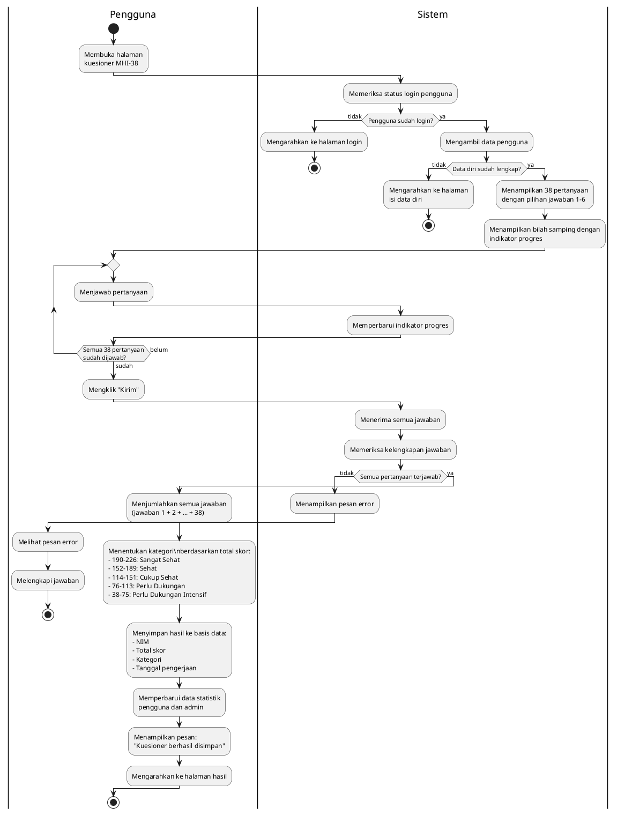
```plantuml
@startuml
|Pengguna|
start
:Membuka halaman\nkuesioner MHI-38;

|Sistem|
:Memeriksa status login pengguna;

if (Pengguna sudah login?) then (tidak)
  :Mengarahkan ke halaman login;
  stop
else (ya)
  :Mengambil data pengguna;

  if (Data diri sudah lengkap?) then (tidak)
    :Mengarahkan ke halaman\nisi data diri;
    stop
  else (ya)
    :Menampilkan 38 pertanyaan\ndengan pilihan jawaban 1-6;

    :Menampilkan bilah samping dengan\nindikator progres;
  endif
endif

|Pengguna|
repeat
  :Menjawab pertanyaan;
  |Sistem|
  :Memperbarui indikator progres;
  |Pengguna|
repeat while (Semua 38 pertanyaan\nsudah dijawab?) is (belum) not (sudah)

:Mengklik "Kirim";

|Sistem|
:Menerima semua jawaban;

:Memeriksa kelengkapan jawaban;

if (Semua pertanyaan terjawab?) then (tidak)
  :Menampilkan pesan error;
  |Pengguna|
  :Melihat pesan error;
  :Melengkapi jawaban;
  stop
else (ya)
  :Menjumlahkan semua jawaban\n(jawaban 1 + 2 + ... + 38);

  :Menentukan kategori\nberdasarkan total skor:
  - 190-226: Sangat Sehat
  - 152-189: Sehat
  - 114-151: Cukup Sehat
  - 76-113: Perlu Dukungan
  - 38-75: Perlu Dukungan Intensif;

  :Menyimpan hasil ke basis data:
  - NIM
  - Total skor
  - Kategori
  - Tanggal pengerjaan;

  :Memperbarui data statistik\npengguna dan admin;

  :Menampilkan pesan:\n"Kuesioner berhasil disimpan";

  :Mengarahkan ke halaman hasil;
endif

stop
@enduml
```

---

## Activity Diagram: Melihat Hasil Tes

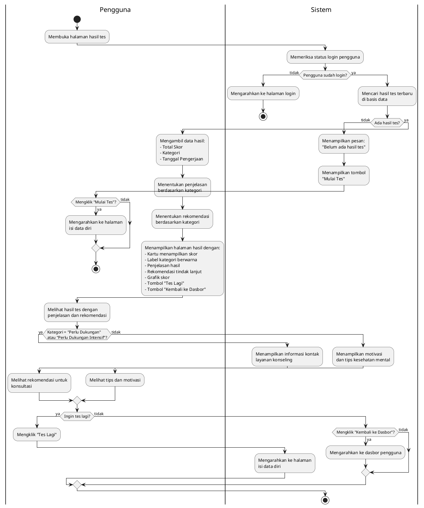
```plantuml
@startuml
|Pengguna|
start
:Membuka halaman hasil tes;

|Sistem|
:Memeriksa status login pengguna;

if (Pengguna sudah login?) then (tidak)
  :Mengarahkan ke halaman login;
  stop
else (ya)
  :Mencari hasil tes terbaru\ndi basis data;

  if (Ada hasil tes?) then (tidak)
    :Menampilkan pesan:\n"Belum ada hasil tes";
    :Menampilkan tombol\n"Mulai Tes";

    |Pengguna|
    if (Mengklik "Mulai Tes"?) then (ya)
      :Mengarahkan ke halaman\nisi data diri;
    else (tidak)
    endif
    stop
  else (ya)
    :Mengambil data hasil:
    - Total Skor
    - Kategori
    - Tanggal Pengerjaan;

    :Menentukan penjelasan\nberdasarkan kategori;

    :Menentukan rekomendasi\nberdasarkan kategori;

    :Menampilkan halaman hasil dengan:
    - Kartu menampilkan skor
    - Label kategori berwarna
    - Penjelasan hasil
    - Rekomendasi tindak lanjut
    - Grafik skor
    - Tombol "Tes Lagi"
    - Tombol "Kembali ke Dasbor";
  endif
endif

|Pengguna|
:Melihat hasil tes dengan\npenjelasan dan rekomendasi;

if (Kategori = "Perlu Dukungan"\natau "Perlu Dukungan Intensif"?) then (ya)
  |Sistem|
  :Menampilkan informasi kontak\nlayanan konseling;
  |Pengguna|
  :Melihat rekomendasi untuk\nkonsultasi;
else (tidak)
  |Sistem|
  :Menampilkan motivasi\ndan tips kesehatan mental;
  |Pengguna|
  :Melihat tips dan motivasi;
endif

if (Ingin tes lagi?) then (ya)
  :Mengklik "Tes Lagi";
  |Sistem|
  :Mengarahkan ke halaman\nisi data diri;
else (tidak)
  if (Mengklik "Kembali ke Dasbor"?) then (ya)
    :Mengarahkan ke dasbor pengguna;
  else (tidak)
  endif
endif

stop
@enduml
```

---

# BAGIAN 3: FITUR KESEHATAN MENTAL - ADMIN

---

## Activity Diagram: Melihat Dasbor Admin

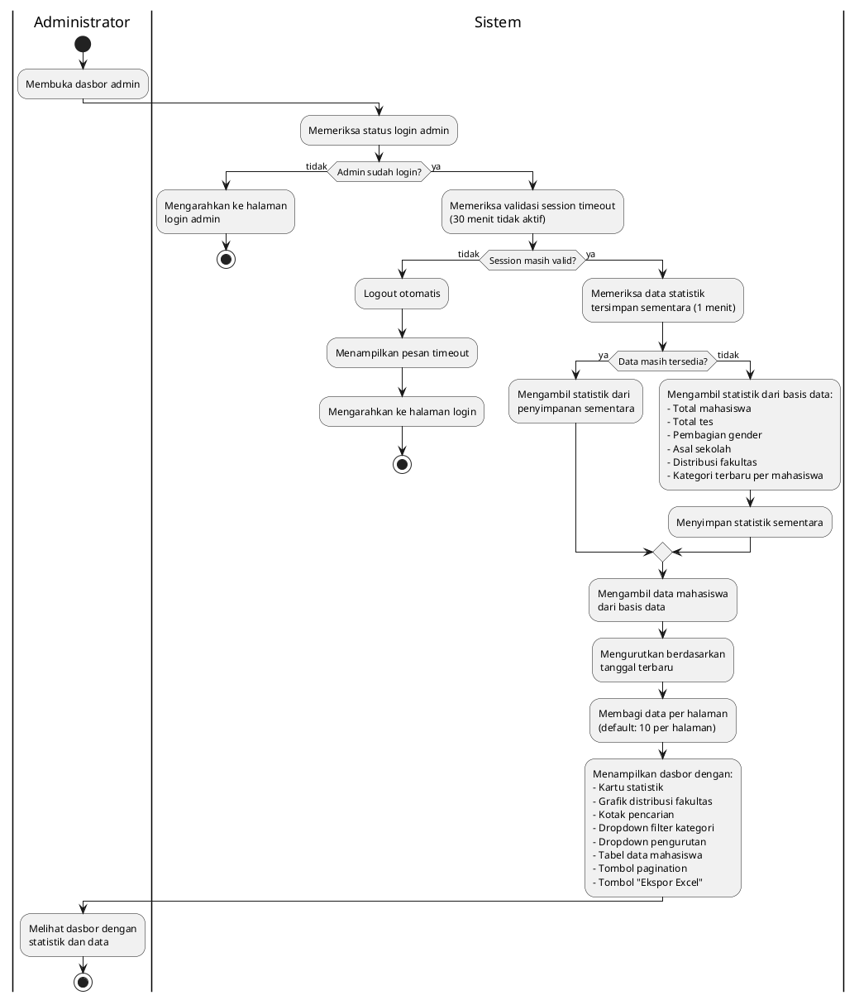
```plantuml
@startuml
|Administrator|
start
:Membuka dasbor admin;

|Sistem|
:Memeriksa status login admin;

if (Admin sudah login?) then (tidak)
  :Mengarahkan ke halaman\nlogin admin;
  stop
else (ya)
  :Memeriksa validasi session timeout\n(30 menit tidak aktif);

  if (Session masih valid?) then (tidak)
    :Logout otomatis;
    :Menampilkan pesan timeout;
    :Mengarahkan ke halaman login;
    stop
  else (ya)
    :Memeriksa data statistik\ntersimpan sementara (1 menit);

    if (Data masih tersedia?) then (ya)
      :Mengambil statistik dari\npenyimpanan sementara;
    else (tidak)
      :Mengambil statistik dari basis data:
      - Total mahasiswa
      - Total tes
      - Pembagian gender
      - Asal sekolah
      - Distribusi fakultas
      - Kategori terbaru per mahasiswa;

      :Menyimpan statistik sementara;
    endif

    :Mengambil data mahasiswa\ndari basis data;

    :Mengurutkan berdasarkan\ntanggal terbaru;

    :Membagi data per halaman\n(default: 10 per halaman);

    :Menampilkan dasbor dengan:
    - Kartu statistik
    - Grafik distribusi fakultas
    - Kotak pencarian
    - Dropdown filter kategori
    - Dropdown pengurutan
    - Tabel data mahasiswa
    - Tombol pagination
    - Tombol "Ekspor Excel";
  endif
endif

|Administrator|
:Melihat dasbor dengan\nstatistik dan data;

stop
@enduml
```

---

## Activity Diagram: Mencari dan Menyaring Data

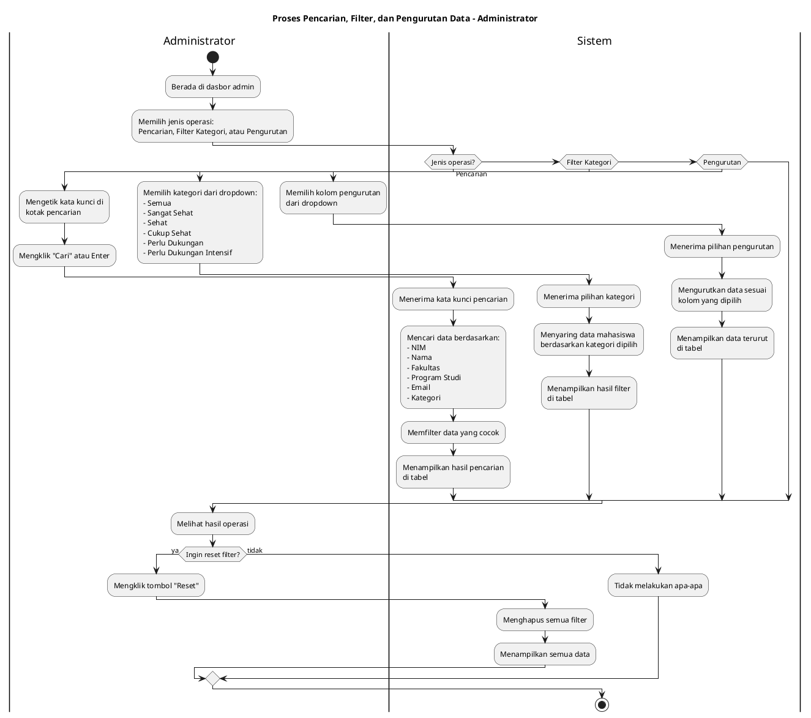
```plantuml
@startuml
title Proses Pencarian, Filter, dan Pengurutan Data - Administrator

|Administrator|
start
:Berada di dasbor admin;

|Administrator|
:Memilih jenis operasi:\nPencarian, Filter Kategori, atau Pengurutan;

|Sistem|
if (Jenis operasi?) then (Pencarian)
  |Administrator|
  :Mengetik kata kunci di\nkotak pencarian;
  :Mengklik "Cari" atau Enter;

  |Sistem|
  :Menerima kata kunci pencarian;
  :Mencari data berdasarkan:
  - NIM
  - Nama
  - Fakultas
  - Program Studi
  - Email
  - Kategori;
  :Memfilter data yang cocok;
  :Menampilkan hasil pencarian\ndi tabel;

elseif (Filter Kategori)
  |Administrator|
  :Memilih kategori dari dropdown:
  - Semua
  - Sangat Sehat
  - Sehat
  - Cukup Sehat
  - Perlu Dukungan
  - Perlu Dukungan Intensif;

  |Sistem|
  :Menerima pilihan kategori;
  :Menyaring data mahasiswa\nberdasarkan kategori dipilih;
  :Menampilkan hasil filter\ndi tabel;

elseif (Pengurutan)
  |Administrator|
  :Memilih kolom pengurutan\ndari dropdown;

  |Sistem|
  :Menerima pilihan pengurutan;
  :Mengurutkan data sesuai\nkolom yang dipilih;
  :Menampilkan data terurut\ndi tabel;
endif

|Administrator|
:Melihat hasil operasi;

if (Ingin reset filter?) then (ya)
  :Mengklik tombol "Reset";
  |Sistem|
  :Menghapus semua filter;
  :Menampilkan semua data;
else (tidak)
  :Tidak melakukan apa-apa;
endif

stop
@enduml

```

---

## Activity Diagram: Melihat Detail Mahasiswa

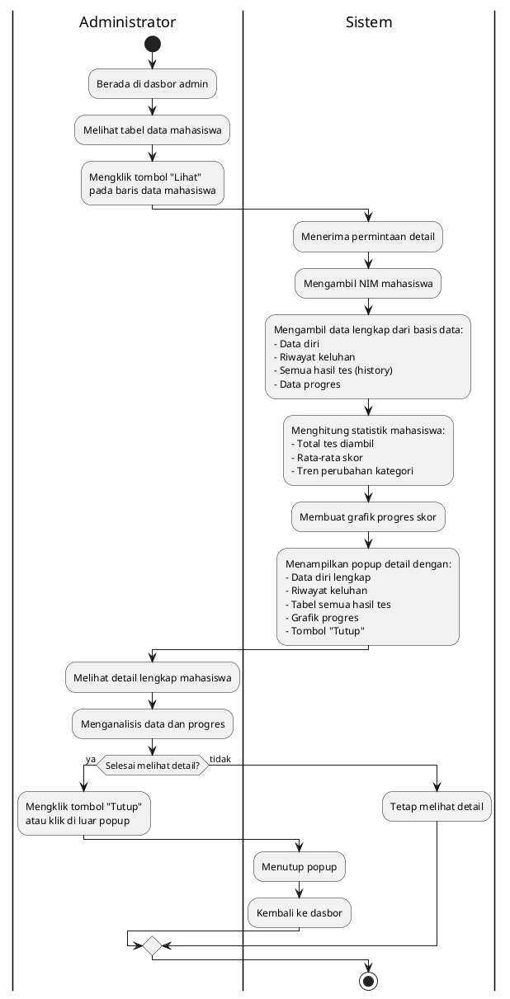
```plantuml
@startuml
|Administrator|
start
:Berada di dasbor admin;

:Melihat tabel data mahasiswa;

:Mengklik tombol "Lihat"\npada baris data mahasiswa;

|Sistem|
:Menerima permintaan detail;

:Mengambil NIM mahasiswa;

:Mengambil data lengkap dari basis data:
- Data diri
- Riwayat keluhan
- Semua hasil tes (history)
- Data progres;

:Menghitung statistik mahasiswa:
- Total tes diambil
- Rata-rata skor
- Tren perubahan kategori;

:Membuat grafik progres skor;

:Menampilkan popup detail dengan:
- Data diri lengkap
- Riwayat keluhan
- Tabel semua hasil tes
- Grafik progres
- Tombol "Tutup";

|Administrator|
:Melihat detail lengkap mahasiswa;

:Menganalisis data dan progres;

if (Selesai melihat detail?) then (ya)
  :Mengklik tombol "Tutup"\natau klik di luar popup;

  |Sistem|
  :Menutup popup;

  :Kembali ke dasbor;
else (tidak)
  :Tetap melihat detail;
endif

stop
@enduml
```

---

## Activity Diagram: Mengekspor Data ke Excel

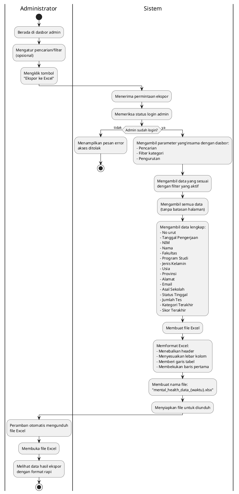
```plantuml
@startuml
|Administrator|
start
:Berada di dasbor admin;

:Mengatur pencarian/filter\n(opsional);

:Mengklik tombol\n"Ekspor ke Excel";

|Sistem|
:Menerima permintaan ekspor;

:Memeriksa status login admin;

if (Admin sudah login?) then (tidak)
  :Menampilkan pesan error\nakses ditolak;
  stop
else (ya)
  :Mengambil parameter yang\nsama dengan dasbor:
  - Pencarian
  - Filter kategori
  - Pengurutan;

  :Mengambil data yang sesuai\ndengan filter yang aktif;

  :Mengambil semua data\n(tanpa batasan halaman);

  :Mengambil data lengkap:
  - No urut
  - Tanggal Pengerjaan
  - NIM
  - Nama
  - Fakultas
  - Program Studi
  - Jenis Kelamin
  - Usia
  - Provinsi
  - Alamat
  - Email
  - Asal Sekolah
  - Status Tinggal
  - Jumlah Tes
  - Kategori Terakhir
  - Skor Terakhir;

  :Membuat file Excel;

  :Memformat Excel:
  - Menebalkan header
  - Menyesuaikan lebar kolom
  - Memberi garis tabel
  - Membekukan baris pertama;

  :Membuat nama file:\n"mental_health_data_{waktu}.xlsx";

  :Menyiapkan file untuk diunduh;
endif

|Administrator|
:Peramban otomatis mengunduh\nfile Excel;

:Membuka file Excel;

:Melihat data hasil ekspor\ndengan format rapi;

stop
@enduml
```

---

## Activity Diagram: Melihat Detail Jawaban Kuesioner

**Update: 13 November 2025**

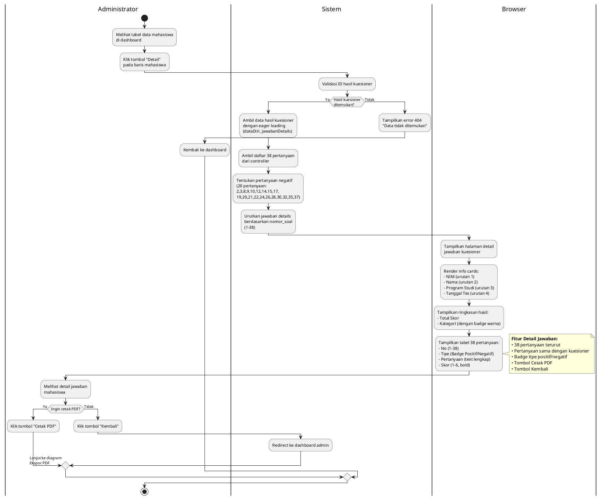
```plantuml
@startuml
|Administrator|
start
:Melihat tabel data mahasiswa\ndi dashboard;

:Klik tombol "Detail"\npada baris mahasiswa;

|Sistem|
:Validasi ID hasil kuesioner;

if (Hasil kuesioner\nditemukan?) then (Ya)
  :Ambil data hasil kuesioner\ndengan eager loading\n(dataDiri, jawabanDetails);

  :Ambil daftar 38 pertanyaan\ndari controller;

  :Tentukan pertanyaan negatif\n(20 pertanyaan:\n2,3,8,9,10,12,14,15,17,\n19,20,21,22,24,26,28,30,32,35,37);

  :Urutkan jawaban details\nberdasarkan nomor_soal\n(1-38);

  |Browser|
  :Tampilkan halaman detail\njawaban kuesioner;

  :Render info cards:\n- NIM (urutan 1)\n- Nama (urutan 2)\n- Program Studi (urutan 3)\n- Tanggal Tes (urutan 4);

  :Tampilkan ringkasan hasil:\n- Total Skor\n- Kategori (dengan badge warna);

  :Tampilkan tabel 38 pertanyaan:\n- No (1-38)\n- Tipe (Badge Positif/Negatif)\n- Pertanyaan (text lengkap)\n- Skor (1-6, bold);

  note right
    **Fitur Detail Jawaban:**
    • 38 pertanyaan terurut
    • Pertanyaan sama dengan kuesioner
    • Badge tipe positif/negatif
    • Tombol Cetak PDF
    • Tombol Kembali
  end note

  |Administrator|
  :Melihat detail jawaban\nmahasiswa;

  if (Ingin cetak PDF?) then (Ya)
    :Klik tombol "Cetak PDF";
    -> Lanjut ke diagram\nEkspor PDF;
  else (Tidak)
    :Klik tombol "Kembali";
    |Sistem|
    :Redirect ke dashboard admin;
  endif

else (Tidak)
  |Sistem|
  :Tampilkan error 404\n"Data tidak ditemukan";

  |Administrator|
  :Kembali ke dashboard;
endif

stop
@enduml
```

---

## Activity Diagram: Mengekspor Detail Jawaban ke PDF

**Update: 13 November 2025**

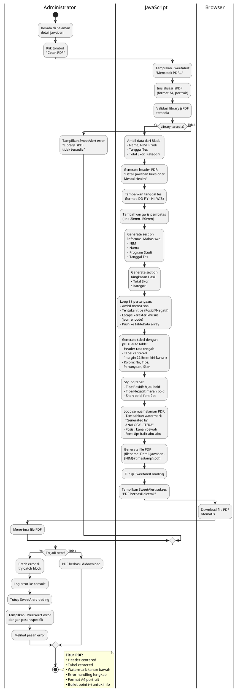
```plantuml
@startuml
|Administrator|
start
:Berada di halaman\ndetail jawaban;

:Klik tombol\n"Cetak PDF";

|JavaScript|
:Tampilkan SweetAlert\n"Mencetak PDF...";

:Inisialisasi jsPDF\n(format A4, portrait);

:Validasi library jsPDF\ntersedia;

if (Library tersedia?) then (Ya)
  :Ambil data dari Blade:\n- Nama, NIM, Prodi\n- Tanggal Tes\n- Total Skor, Kategori;

  :Generate header PDF:\n"Detail Jawaban Kuesioner\nMental Health";

  :Tambahkan tanggal tes\n(format: DD F Y - H:i WIB);

  :Tambahkan garis pembatas\n(line 20mm-190mm);

  :Generate section\nInformasi Mahasiswa:\n• NIM\n• Nama\n• Program Studi\n• Tanggal Tes;

  :Generate section\nRingkasan Hasil:\n• Total Skor\n• Kategori;

  :Loop 38 pertanyaan:\n- Ambil nomor soal\n- Tentukan tipe (Positif/Negatif)\n- Escape karakter khusus\n  (json_encode)\n- Push ke tableData array;

  :Generate tabel dengan\njsPDF autoTable:\n- Header rata tengah\n- Tabel centered\n  (margin 22.5mm kiri-kanan)\n- Kolom: No, Tipe,\n  Pertanyaan, Skor;

  :Styling tabel:\n- Tipe Positif: hijau bold\n- Tipe Negatif: merah bold\n- Skor: bold, font 9pt;

  :Loop semua halaman PDF:\n- Tambahkan watermark\n  "Generated by\n  ANALOGY - ITERA"\n- Posisi: kanan bawah\n- Font: 8pt italic abu-abu;

  :Generate file PDF\n(filename: Detail-Jawaban-\n{NIM}-{timestamp}.pdf);

  :Tutup SweetAlert loading;

  :Tampilkan SweetAlert sukses\n"PDF berhasil dicetak";

  |Browser|
  :Download file PDF\notomatis;

  |Administrator|
  :Menerima file PDF;

else (Tidak)
  :Tampilkan SweetAlert error\n"Library jsPDF\ntidak tersedia";
endif

if (Terjadi error?) then (Ya)
  :Catch error di\ntry-catch block;

  :Log error ke console;

  :Tutup SweetAlert loading;

  :Tampilkan SweetAlert error\ndengan pesan spesifik;

  |Administrator|
  :Melihat pesan error;
else (Tidak)
  :PDF berhasil didownload;
endif

stop

note right
  **Fitur PDF:**
  • Header centered
  • Tabel centered
  • Watermark kanan bawah
  • Error handling lengkap
  • Format A4 portrait
  • Bullet point (•) untuk info
end note

@enduml
```

---

## Activity Diagram: Menghapus Data Mahasiswa

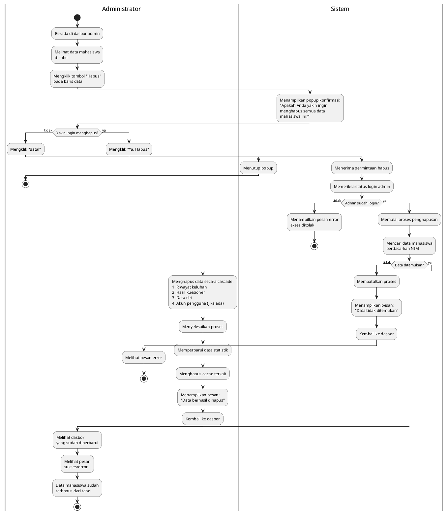
```plantuml
@startuml
|Administrator|
start
:Berada di dasbor admin;

:Melihat data mahasiswa\ndi tabel;

:Mengklik tombol "Hapus"\npada baris data;

|Sistem|
:Menampilkan popup konfirmasi:\n"Apakah Anda yakin ingin\nmenghapus semua data\nmahasiswa ini?";

|Administrator|
if (Yakin ingin menghapus?) then (tidak)
  :Mengklik "Batal";
  |Sistem|
  :Menutup popup;
  |Administrator|
  stop
else (ya)
  :Mengklik "Ya, Hapus";

  |Sistem|
  :Menerima permintaan hapus;

  :Memeriksa status login admin;

  if (Admin sudah login?) then (tidak)
    :Menampilkan pesan error\nakses ditolak;
    stop
  else (ya)
    :Memulai proses penghapusan;

    :Mencari data mahasiswa\nberdasarkan NIM;

    if (Data ditemukan?) then (tidak)
      :Membatalkan proses;
      :Menampilkan pesan:\n"Data tidak ditemukan";
      :Kembali ke dasbor;
      |Administrator|
      :Melihat pesan error;
      stop
    else (ya)
      :Menghapus data secara cascade:
      1. Riwayat keluhan
      2. Hasil kuesioner
      3. Data diri
      4. Akun pengguna (jika ada);

      :Menyelesaikan proses;

      :Memperbarui data statistik;

      :Menghapus cache terkait;

      :Menampilkan pesan:\n"Data berhasil dihapus";

      :Kembali ke dasbor;
    endif
  endif
endif

|Administrator|
:Melihat dasbor\nyang sudah diperbarui;

:Melihat pesan\nsukses/error;

:Data mahasiswa sudah\nterhapus dari tabel;

stop
@enduml
```

---

## Penjelasan Tambahan

### Kategori Kesehatan Mental (berdasarkan Total Skor MHI-38)

| Total Skor | Kategori                | Interpretasi                                     |
| ---------- | ----------------------- | ------------------------------------------------ |
| 190-226    | Sangat Sehat            | Kondisi mental sangat baik, terus pertahankan    |
| 152-189    | Sehat                   | Kondisi mental baik, jaga pola hidup sehat       |
| 114-151    | Cukup Sehat             | Kondisi mental cukup baik, perlu perhatian lebih |
| 76-113     | Perlu Dukungan          | Disarankan untuk konsultasi dengan konselor      |
| 38-75      | Perlu Dukungan Intensif | Sangat disarankan segera konsultasi profesional  |

### Skala Likert MHI-38

Setiap pertanyaan menggunakan skala 1-6:

-   1 = Tidak pernah
-   2 = Jarang
-   3 = Kadang-kadang
-   4 = Sering
-   5 = Sangat sering
-   6 = Selalu

Total skor dihitung dengan menjumlahkan semua jawaban (38 pertanyaan × max 6 poin = 228 poin maksimal, namun kategori tertinggi sampai 226).

### Fitur Cache

-   **User Dashboard**: Cache 5 menit per user (key: `user_dashboard_{nim}`)
-   **Admin Stats**: Cache 1 menit (key: `admin_mental_health_stats`)
-   Cache di-invalidate saat:
    -   User submit kuesioner baru
    -   Admin hapus data mahasiswa

### Fitur Keamanan

-   Middleware `auth` untuk semua route user
-   Middleware `AdminAuth` untuk semua route admin
-   Form validation menggunakan FormRequest
-   CSRF protection pada semua form POST/DELETE
-   Soft delete consideration (saat ini hard delete)

---

## Penjelasan Autentikasi

### Dual Authentication System

Sistem ini menggunakan **dua guard autentikasi terpisah**:

1. **Guard 'web'** - Untuk User/Mahasiswa

    - Menggunakan Google OAuth Single Sign-On
    - Primary key: NIM (9 digit dari email)
    - Email format: `{NIM}@student.itera.ac.id`
    - Session lifetime: 120 menit
    - Tidak ada session timeout otomatis

2. **Guard 'admin'** - Untuk Admin
    - Menggunakan email/password tradisional
    - Session lifetime: 120 menit
    - Session timeout: 30 menit inactivity (via middleware)
    - Password di-hash dengan bcrypt

### Google OAuth Flow (User)

**URL Endpoints:**

-   Redirect: `GET /auth/google/redirect`
-   Callback: `GET /auth/google/callback`

**Environment Variables Required:**

```env
GOOGLE_CLIENT_ID=your_client_id
GOOGLE_CLIENT_SECRET=your_client_secret
GOOGLE_REDIRECT_URI=http://your-app.com/auth/google/callback
```

**Email Validation Regex:**

```regex
/(\d{9})@student\.itera\.ac\.id/
```

**Contoh Email Valid:**

-   `123456789@student.itera.ac.id` → NIM: 123456789 ✅
-   `121450123@student.itera.ac.id` → NIM: 121450123 ✅

**Contoh Email Tidak Valid:**

-   `john@gmail.com` ❌
-   `admin@itera.ac.id` ❌
-   `12345@student.itera.ac.id` ❌ (kurang dari 9 digit)

### Session Management

**Database Table:** `sessions`

**Session Data Structure:**

```php
// User Session (guard: web)
[
    'id' => 'session_id',
    'user_id' => 'nim',
    'payload' => [
        '_token' => 'csrf_token',
        'login_web_...' => 'user_id',
        // other session data
    ],
    'last_activity' => timestamp,
]

// Admin Session (guard: admin)
[
    'id' => 'session_id',
    'user_id' => null,
    'payload' => [
        '_token' => 'csrf_token',
        'login_admin_...' => 'admin_id',
        'last_activity' => timestamp, // untuk timeout check
    ],
    'last_activity' => timestamp,
]
```

### Session Timeout (Admin Only)

**Implementasi:**

-   File: `app/Http/Middleware/AdminAuth.php`
-   Timeout: 30 menit inactivity
-   Trigger: Setiap HTTP request
-   Action: Auto logout jika > 30 menit tidak ada aktivitas

**Cara Kerja:**

1. Setiap request, middleware cek `last_activity` di session
2. Hitung selisih waktu dengan waktu sekarang
3. Jika > 30 menit → logout + redirect ke login
4. Jika ≤ 30 menit → update `last_activity` + lanjutkan request

**Reset Timer:**

-   Setiap klik/navigasi → timer reset ke 0
-   Refresh halaman → timer reset
-   AJAX request → timer reset (jika ada)

### Security Features

1. **CSRF Protection**

    - Semua form POST/DELETE memerlukan CSRF token
    - Token di-regenerate setiap login/logout
    - Validasi di middleware `VerifyCsrfToken`

2. **Session Fixation Prevention**

    - Session ID di-regenerate setiap login
    - Method: `$request->session()->regenerate()`

3. **Password Hashing**

    - Bcrypt untuk admin password
    - Random hash untuk OAuth users (tidak digunakan)

4. **State Token (OAuth)**

    - CSRF protection untuk OAuth flow
    - Validasi state sebelum exchange code

5. **Email Validation**
    - Regex validation untuk email ITERA
    - Hanya `@student.itera.ac.id` diizinkan untuk user

### Database Tables

**Table: `users`**

```sql
CREATE TABLE users (
    id BIGINT AUTO_INCREMENT,
    nim VARCHAR(20) PRIMARY KEY,
    name VARCHAR(255) UNIQUE,
    email VARCHAR(255) UNIQUE,
    google_id VARCHAR(255) UNIQUE,
    password VARCHAR(255) NULLABLE,
    created_at TIMESTAMP,
    updated_at TIMESTAMP
);
```

**Table: `admins`**

```sql
CREATE TABLE admins (
    id BIGINT AUTO_INCREMENT PRIMARY KEY,
    username VARCHAR(255) UNIQUE,
    email VARCHAR(255) UNIQUE,
    password VARCHAR(255),
    created_at TIMESTAMP,
    updated_at TIMESTAMP
);
```

**Table: `sessions`**

```sql
CREATE TABLE sessions (
    id VARCHAR(255) PRIMARY KEY,
    user_id BIGINT NULLABLE,
    payload TEXT,
    last_activity INT,
    ip_address VARCHAR(45),
    user_agent TEXT
);
```

### Routes Mapping

**Public Routes:**

```php
GET  /login                    → login form (guest only)
POST /login                    → process admin login
GET  /auth/google/redirect     → redirect to Google OAuth
GET  /auth/google/callback     → handle OAuth callback
```

**Authenticated Routes:**

```php
POST /logout                   → logout (any authenticated user)
GET  /user/mental-health       → user dashboard (middleware: auth)
GET  /admin                    → admin dashboard (middleware: AdminAuth)
```

### Middleware Groups

**middleware: 'guest'**

-   Redirect ke `/home` jika sudah login
-   Applied to: `/login`

**middleware: 'auth'**

-   Redirect ke `/login` jika belum login
-   Check guard: 'web'
-   Applied to: all `/user/*` routes

**middleware: 'AdminAuth'**

-   Redirect ke `/login` jika belum login
-   Check guard: 'admin'
-   Check session timeout (30 min)
-   Applied to: all `/admin/*` routes

### Error Handling

**Common Errors:**

| Error Code      | Pesan                                   | Solusi                         |
| --------------- | --------------------------------------- | ------------------------------ |
| 401             | Unauthenticated                         | Login terlebih dahulu          |
| 403             | Invalid state token / Email not allowed | Gunakan email ITERA yang valid |
| 419             | CSRF token mismatch                     | Refresh halaman dan coba lagi  |
| 422             | Validation error                        | Perbaiki input form            |
| Session Timeout | Session expired after 30 minutes        | Login ulang (admin only)       |

### Login Flow Summary

**User (Mahasiswa):**

```
1. Klik "Login dengan Google"
2. Redirect ke Google OAuth
3. Pilih akun ITERA
4. Google callback ke app
5. Validasi email format
6. Ekstrak NIM dari email
7. Create/update user account
8. Login dengan Auth::login()
9. Redirect ke dashboard user
```

**Admin:**

```
1. Akses /login
2. Isi email & password
3. Submit form
4. Validasi credentials
5. Login dengan Auth::guard('admin')
6. Regenerate session ID
7. Set last_activity timestamp
8. Redirect ke dashboard admin
```

### Logout Flow

**User & Admin (sama):**

```
1. Klik tombol logout
2. POST /logout dengan CSRF token
3. Deteksi guard yang aktif
4. Logout dari guard
5. Invalidate session
6. Hapus session dari database
7. Regenerate CSRF token
8. Redirect ke /login
```

---

**Cara Render Diagram:**

1. Gunakan tool online seperti [PlantUML Online Editor](http://www.plantuml.com/plantuml/uml/)
2. Copy-paste kode PlantUML di atas
3. Generate menjadi gambar PNG/SVG
4. Atau gunakan VS Code extension: "PlantUML"

---

**Dibuat:** 10 November 2025 (Diperbarui: 11 November 2025)
**Sistem:** Mental Health Assessment - Institut Teknologi Sumatera
**Total Diagram:** 15 Activity Diagram + 2 Use Case Diagram = 17 Diagram

### Struktur Diagram:

Setiap Activity Diagram merepresentasikan **satu proses spesifik** yang fokus dan terpisah:

#### **Bagian 1: Autentikasi (4 Activity Diagram)**

1. **Login Pengguna dengan Google OAuth** - Proses lengkap login mahasiswa menggunakan akun Google ITERA
2. **Login Admin** - Proses login admin dengan email/password dan validasi credentials
3. **Logout** - Proses logout untuk pengguna dan admin
4. **Validasi Session Timeout Admin** - Monitoring dan auto-logout admin setelah 30 menit tidak aktif

#### **Bagian 2: Fitur Pengguna (4 Activity Diagram)**

5. **Melihat Dasbor Pengguna** - Menampilkan statistik, riwayat, dan grafik progres tes
6. **Mengisi Data Diri** - Proses pengisian/update data pribadi dan riwayat keluhan
7. **Mengisi Kuesioner MHI-38** - Proses menjawab 38 pertanyaan dengan perhitungan skor otomatis
8. **Melihat Hasil Tes** - Menampilkan hasil, kategori, dan rekomendasi berdasarkan skor

#### **Bagian 3: Fitur Admin (7 Activity Diagram)**

9. **Melihat Dasbor Admin** - Menampilkan statistik global dan tabel data mahasiswa
10. **Mencari dan Menyaring Data** - Fitur pencarian, filter kategori, dan pengurutan data
11. **Melihat Detail Mahasiswa** - Menampilkan popup dengan data lengkap dan grafik progres mahasiswa
12. **Melihat Detail Jawaban Kuesioner (NEW)** - Menampilkan 38 pertanyaan dengan jawaban dan tipe per pertanyaan
13. **Mengekspor Detail Jawaban ke PDF (NEW)** - Generate PDF detail jawaban dengan watermark ANALOGY-ITERA
14. **Mengekspor Data ke Excel** - Generate dan download file Excel dengan format terstruktur
15. **Menghapus Data Mahasiswa** - Proses hapus data cascade dengan konfirmasi

### Karakteristik Diagram:

-   ✅ **Spesifik dan Fokus** - Setiap diagram merepresentasikan 1 proses/aksi spesifik
-   ✅ **Mudah Dipahami** - Alur sederhana tanpa terlalu banyak cabang kompleks
-   ✅ **Modular** - Diagram terpisah memudahkan maintenance dan update
-   ✅ **Lengkap** - Mencakup semua fitur utama sistem dari pengguna dan admin
-   ✅ **Bahasa Indonesia** - Konsisten menggunakan terminologi Indonesia yang formal
